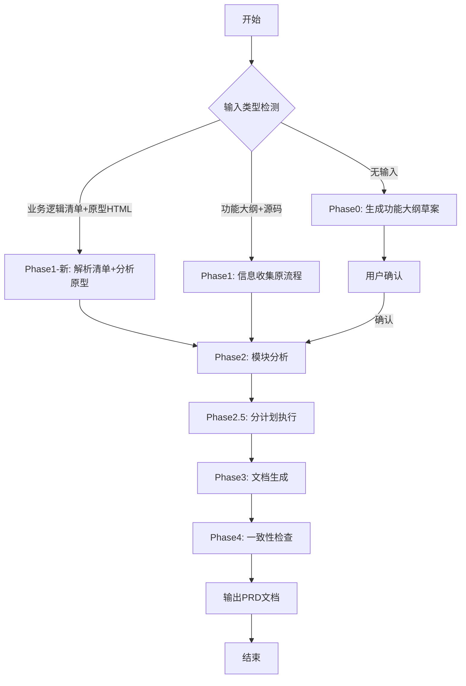

# PRD文档自动生成技能 V3.0

基于业务逻辑清单+原型HTML、或功能大纲+源码分析，自动化生成标准化产品需求文档的专业技能。

**V3.0 新增双输入模式：**
- 模式1：业务逻辑清单 + 原型HTML（来自 logic-list-spec + prototype-design）
- 模式2：功能大纲 + 源码（原有模式）

---

## 使用场景

| 模式 | 适用场景 | 输入来源 |
|------|----------|----------|
| **业务逻辑清单模式** | 已有完整业务规格和原型 | logic-list-spec Extract输出 + prototype-design输出 |
| **功能大纲模式** | 已有功能大纲和源码 | feature-outline.md + 源码目录 |
| **无输入模式** | 需要从零开始 | Phase0生成功能大纲草案 |

---

## 技能链衔接

---

## 输入参数

### 模式1：业务逻辑清单+原型HTML

| 参数名称 | 参数说明 | 示例值 |
|----------|----------|--------|
| 业务逻辑清单路径 | 正式版业务逻辑清单文件路径 | doc/V0.3/业务逻辑清单_V0.3.md |
| 原型HTML目录 | 原型页面HTML文件目录 | pages/ |
| 输出路径 | 生成的PRD文档保存路径 | PRD-{项目名}-V1.0.md |

### 模式2：功能大纲+源码（原有）

| 参数名称 | 参数说明 | 示例值 |
|----------|----------|--------|
| 功能大纲路径 | 项目功能结构大纲文件路径 | feature-outline.md |
| 规范文档路径 | 需求文档编写规范模板路径 | references/prd-template-specification.md |
| 源码目录 | 项目源码根目录 | src/ |
| 输出路径 | 生成的PRD文档保存路径 | PRD-{项目名}-V1.0.md |

---

## 执行流程概览

### 详细执行阶段

| 阶段 | 说明 | 参考文档 |
|------|------|----------|
| Phase 0 | 功能大纲确认：分析源码生成功能大纲草案 | [prompts/phase0-outline-confirm.md](prompts/phase0-outline-confirm.md) |
| Phase 1 | 信息收集：读取功能大纲、解析规范、扫描源码 | [prompts/phase1-info-collect.md](prompts/phase1-info-collect.md) |
| Phase 1-新 | 业务逻辑清单解析：解析清单结构、提取用例/字段/规则 | [prompts/phase1-logic-list-parse.md](prompts/phase1-logic-list-parse.md) |
| Phase 2 | 模块分析：判断模块是否需要拆分 | [prompts/phase2-module-analysis.md](prompts/phase2-module-analysis.md) |
| Phase 2.5 | 分计划执行：按小节数量计算计划数，分步生成 | [prompts/phase2.5-plan-execution.md](prompts/phase2.5-plan-execution.md) |
| Phase 3 | 文档生成：按标准章节结构生成内容 | [prompts/phase3-doc-generation.md](prompts/phase3-doc-generation.md) |
| Phase 4 | 一致性检查：对比大纲、校验规则 | [prompts/phase4-consistency-check.md](prompts/phase4-consistency-check.md) |

---

## 核心规则索引

| 规则类型 | 说明 | 参考文档 |
|----------|------|----------|
| 业务逻辑清单映射 | 清单各部分→PRD章节映射规则 | [rules/logic-list-mapping.md](rules/logic-list-mapping.md) |
| 原型HTML分析 | 从原型HTML提取输入项/输出项/交互 | [rules/prototype-html-analysis.md](rules/prototype-html-analysis.md) |
| 流程图编写 | 绘制场景判定、节点命名、与业务规则映射 | [rules/flowchart-rules.md](rules/flowchart-rules.md) |
| 源码分析 | HTML/JS/TypeScript项目分析方法 | [rules/sourcecode-analysis.md](rules/sourcecode-analysis.md) |
| 命名规范 | 字段标识snake_case、标题编号格式 | [rules/naming-conventions.md](rules/naming-conventions.md) |
| 章节生成 | 按需生成判断表、典型场景示例 | [rules/chapter-generation.md](rules/chapter-generation.md) |

---

## 输出模板索引

| 模板类型 | 说明 | 参考文档 |
|----------|------|----------|
| 文档头部 | 前置章节结构 | [templates/prd-header.md](templates/prd-header.md) |
| 页面章节 | 六级子项完整模板 | [templates/prd-page-section.md](templates/prd-page-section.md) |
| 文档尾部 | 非功能需求、附录、版本记录 | [templates/prd-footer.md](templates/prd-footer.md) |
| 业务规则表 | 规则编号命名、表格格式 | [templates/business-rule-table.md](templates/business-rule-table.md) |

---

## 校验工具索引

| 工具类型 | 说明 | 参考文档 |
|----------|------|----------|
| 输入验证 | 业务逻辑清单+原型HTML输入验证 | [validators/input-validator.md](validators/input-validator.md) |
| 质量检查清单 | 6大类检查项 | [validators/quality-checklist.md](validators/quality-checklist.md) |
| 常见错误对照 | 15种错误类型 | [validators/common-errors.md](validators/common-errors.md) |
| 格式校验脚本 | 自动校验PRD格式 | [scripts/validate-prd.sh](scripts/validate-prd.sh) |
| 一致性校验脚本 | 校验与大纲一致性 | [scripts/check-consistency.sh](scripts/check-consistency.sh) |

---

## 参考文档

| 文档名称 | 说明 |
|----------|------|
| [references/logic-list-input-example.md](references/logic-list-input-example.md) | 业务逻辑清单输入示例 |
| [references/prd-template-specification.md](references/prd-template-specification.md) | PRD文档章节结构规范 |
| [references/example-feature-outline.md](references/example-feature-outline.md) | 功能大纲格式示例 |
| [references/example-prd-output-v3.md](references/example-prd-output-v3.md) | V3.0完整PRD示例 |

---

## 测试用例

| 用例名称 | 测试场景 |
|----------|----------|
| [test-cases/simple-component.json](test-cases/simple-component.json) | 简单配置组件 |
| [test-cases/complex-flow.json](test-cases/complex-flow.json) | 复杂操作流程 |
| [test-cases/state-machine.json](test-cases/state-machine.json) | 状态机设计 |