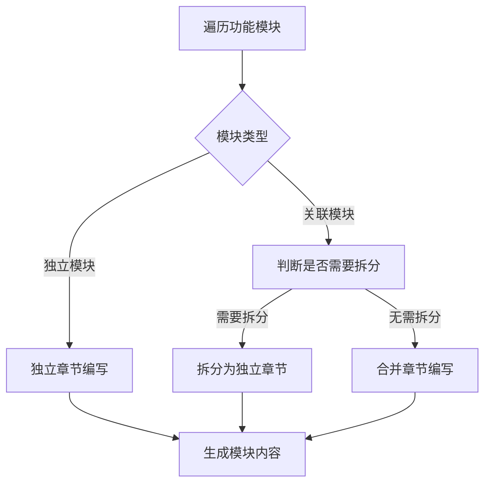
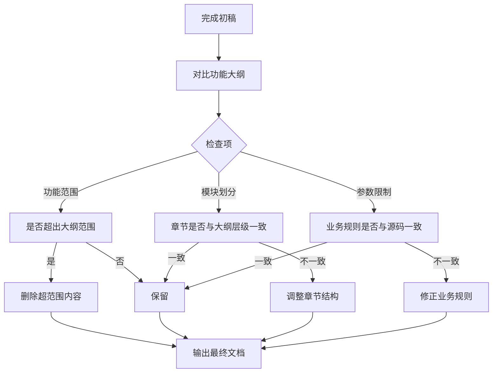
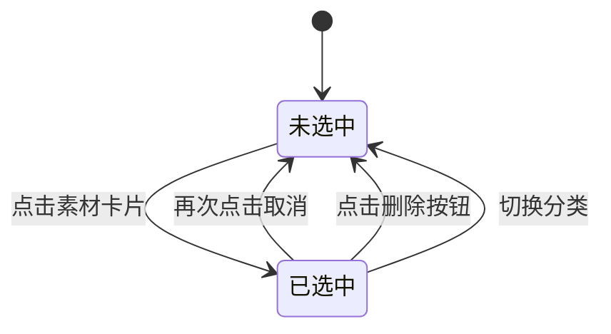

# PRD文档自动生成技能

基于项目功能大纲、源码分析和需求文档规范，自动化生成标准化产品需求文档的专业技能。

## 使用场景

- 需要为新项目或新功能模块创建PRD文档
- 已有功能大纲和源码，需要规范化输出需求文档
- 需要确保PRD文档与功能大纲、实际代码保持一致

## 输入参数

| 参数名称 | 参数说明 | 示例值 |
|----------|----------|--------|
| 功能大纲路径 | 项目功能结构大纲文件路径 | feature-outline.md |
| 规范文档路径 | 需求文档编写规范模板路径 | C:\Users\Administrator\.qoder\skills\prd-auto-generator\references\prd-template-specification.md |
| 源码目录 | 项目源码根目录 | src/ |
| 输出路径 | 生成的PRD文档保存路径，需包含版本号 | PRD-{项目名}-V1.0.md |

## 执行流程

### 第一阶段：信息收集


**具体操作**：
1. 读取功能大纲文件，识别核心功能模块层级
2. 解析需求文档规范，确定PRD章节结构模板
3. 扫描源码目录，定位关键实现文件：
   - 类型定义文件（types/*.ts）
   - 页面组件文件（pages/*/index.tsx）
   - 数据模型文件（mock/*.ts）

### 第二阶段：模块分析



**拆分判断规则**：
- 若功能大纲中模块A和模块B并列且功能独立，应拆分为独立章节
- 若模块间存在强依赖关系，可合并为同一章节
- 例：图片库和视频库功能相似但独立，应拆分为两个独立章节

### 第三阶段：文档生成

**标准章节结构**（遵循需求文档规范）：

```
# 1. 需求背景【仅标题，后续补充】

# 2. 需求分析【仅标题，后续补充】

# 3. 系统流程图【仅标题，后续补充】

# 4. 详细需求【仅标题，标题下无内容】

## 4.1. {系统名称}【系统标题下无内容】

### 4.1.1. {模块名称}【模块标题下无内容】

#### 4.1.1.1. {页面名称}【除必须外，其余按需决定是否配置】

##### 1. 功能概述【必须】
- 功能描述、业务描述、使用角色、触发条件

##### 2. 界面设计
###### 2.1 页面原型【必须，可留白后续补充】
- 原型图链接
###### 2.2 输出项说明
| 字段名称 | 字段标识 | 数据类型 | 数据来源 | 格式说明 |

##### 3. 业务逻辑
###### 3.1 流程图
- 使用Mermaid/PlantUML
###### 3.2 业务规则
| 规则编号 | 规则名称 | 适用场景 | 规则描述 | 错误提示 |
###### 3.3 状态机设计
- 状态定义、状态流转规则、状态对应UI差异

##### 4. 交互设计
###### 4.1 输入项说明
| 字段名称 | 字段标识 | 字段类型 | 必填 | 数据类型 | 长度限制 | 校验规则 | 取值范围 | 来源 | 提示文案 | 备注 |
###### 4.2 交互说明
- 分步骤描述用户操作流程
###### 4.3 错误提示文案
- 表单校验提示、业务异常提示

##### 5. 数据设计
###### 5.1 数据流转说明
| 字段/数据 | 来源 | 获取方式 | 说明 |
###### 5.2 数据权限设计
- 角色数据范围、功能权限点

##### 6. 扩展功能【按需】
###### 6.1 批量操作规则
| 操作名称 | 单次上限 | 前置条件 | 成功提示 |
###### 6.2 操作日志要求
| 操作类型 | 记录内容 | 保留时长 |
```

### 章节标注说明

**重要**：章节标注仅用于技能指导和模板说明，生成PRD文档时必须移除所有标注内容。

| 标注 | 含义 | 处理方式 |
|------|------|----------|
| `【必须】` | 必须包含的内容 | 必须编写，不可跳过，生成文档时移除标注 |
| `【按需】` | 根据功能需要决定 | 有则编写，无则可省略，生成文档时移除标注 |
| `【系统标题下无内容】` | 系统级别标题仅作为层级容器 | 标题下不编写内容，生成文档时移除标注 |
| `【模块标题下无内容】` | 模块级别标题仅作为层级容器 | 标题下不编写内容，生成文档时移除标注 |
| `【仅标题，标题下无内容】` | 该级标题仅作为结构划分 | 不编写概述性内容，生成文档时移除标注 |
| `【仅标题，后续补充】` | 该章节仅保留标题 | 标题下不编写内容，生成文档时移除标注 |
| `【除必须外，其余按需决定是否配置】` | 页面级别标题 | 必须包含功能概述，其余按需，生成文档时移除标注 |
| `【必须，可留白后续补充】` | 必须有但可留白 | 必须保留标题，内容可后续补充，生成文档时移除标注 |

**标注清理规则**：
生成PRD文档时，需清理以下标注模式：
- `【必须】` → 移除
- `【按需】` → 移除
- `【系统标题下无内容】` → 移除
- `【模块标题下无内容】` → 移除
- `【仅标题，标题下无内容】` → 移除
- `【仅标题，后续补充】` → 移除
- `【除必须外，其余按需决定是否配置】` → 移除
- `【必须，可留白后续补充】` → 移除

### 第四阶段：一致性检查



## 流程图编写细则

### 绘制场景判定

**必须绘制流程图的场景**：

| 场景类型 | 是否必须 | 流程图类型 | 示例 |
|----------|----------|------------|------|
| 用户操作流程（上传/删除/移动） | ✅ 必须 | flowchart TD | 上传图片流程、删除素材流程 |
| 多状态流转（审核/订单状态） | ✅ 必须 | stateDiagram-v2 | 审核状态流转、订单状态变化 |
| 数据跨模块流转 | ✅ 必须 | flowchart LR | 素材选择数据流转 |
| 简单CRUD操作 | ⚪ 可选 | flowchart TD | 列表查询 |
| 无状态的单步操作 | ❌ 不需要 | - | 简单的点击跳转 |

**判断依据**：
- 涉及多步骤操作 → 必须绘制
- 包含条件分支判断 → 必须绘制
- 存在状态变化 → 必须绘制
- 单一操作无分支 → 可省略

### 流程图类型选择指南

| 流程图类型 | 适用场景 | 方向说明 | 示例 |
|------------|----------|----------|------|
| `flowchart TD` | 用户操作流程、业务处理流程 | 自顶向下 | 上传流程、删除流程、移动流程 |
| `flowchart LR` | 数据流转、模块交互 | 从左到右 | 模块间数据同步、系统交互 |
| `stateDiagram-v2` | 状态机设计、状态流转 | 状态节点 | 素材选中状态、审核状态、订单状态 |
| `sequenceDiagram` | 时序交互（可选） | 时间线 | API调用时序、系统交互时序 |

### 节点命名规范

**节点类型与格式**：

| 节点类型 | 格式规范 | 示例 |
|----------|----------|------|
| 起始节点 | `[开始]` | `[开始]` |
| 结束节点 | `[结束]` | `[结束]` |
| 操作节点 | `[执行XX操作]` 或 `[XX操作描述]` | `[打开上传弹窗]`、`[保存素材信息]` |
| 判断节点 | `{是否XX条件}` 或 `{XX校验}` | `{文件格式校验}`、`{用户确认}` |

**连接线标注规范**：
- 条件分支必须标注：`|条件说明|`
- 通过条件：`|通过|` 或 `|是|`
- 不通过条件：`|不通过|` 或 `|否|`
- 异常情况：`|超过限制|`、`|格式错误|`

**流程图命名规范**：
```markdown
**{操作名称}流程**


```

### 流程图与业务规则映射

**映射原则**：流程图中的判断分支必须与业务规则表格一一对应。

**映射规范**：

| 流程图元素 | 对应业务规则 | 示例 |
|------------|--------------|------|
| 格式校验分支 | RULE-XXX-001 文件格式限制 | `{文件格式校验} -->|不通过| [提示格式错误]` |
| 大小校验分支 | RULE-XXX-002 文件大小限制 | `{文件大小校验} -->|超过限制| [提示文件过大]` |
| 层级校验分支 | RULE-XXX-003 分类层级限制 | `{层级校验} -->|超限| [提示已达最大层级]` |

**映射检查要点**：
1. 流程图中每个判断节点都应有对应的业务规则
2. 业务规则表格中的错误提示应与流程图中的错误节点文案一致
3. 错误码（如 MAT-001）应与业务异常提示表格对应

**映射示例**：

流程图节点：
```
E --> F{文件格式校验}
F -->|不通过| G[提示"只能上传JPG、JPEG、PNG、GIF、WEBP格式的文件"]
```

对应业务规则表：
```
| RULE-IMG-001 | 文件格式限制 | 上传图片 | 仅支持JPG、JPEG、PNG、GIF、WEBP格式 | 只能上传JPG、JPEG、PNG、GIF、WEBP格式的文件 |
```

### 标准示例

**上传图片流程完整示例**：

```mermaid
flowchart TD
    A[开始] --> B[点击上传图片按钮]
    B --> C[打开上传弹窗]
    C --> D[选择目标分类]
    D --> E[选择或拖拽文件]
    E --> F{文件格式校验}
    F -->|不通过| G[提示"只能上传JPG、JPEG、PNG、GIF、WEBP格式的文件"]
    G --> E
    F -->|通过| H{文件大小校验}
    H -->|超过3MB| I[提示"文件大小不能超过3MB"]
    I --> E
    H -->|通过| J[添加到上传列表]
    J --> K[点击上传按钮]
    K --> L[生成素材ID]
    L --> M[创建本地预览URL]
    M --> N[保存素材信息]
    N --> O[刷新素材列表]
    O --> P[结束]
```

**状态机设计示例**：



**示例规范要点**：
1. 所有分支都有明确的条件标注
2. 异常分支形成闭环（回到操作步骤）
3. 错误提示文案与业务规则表格一致
4. 包含完整的开始和结束节点
5. 节点命名清晰、语义明确

### 流程图完整性检查

**检查项清单**：

| 检查项 | 检查内容 | 是否必须 |
|--------|----------|----------|
| 开始结束节点 | 流程图包含明确的开始和结束节点 | ✅ 必须 |
| 条件标注完整 | 所有判断分支都有明确的条件标注 | ✅ 必须 |
| 异常处理闭环 | 错误/异常分支有处理路径（回到操作或结束） | ✅ 必须 |
| 业务规则对应 | 流程图分支与业务规则表格一一对应 | ✅ 必须 |
| 错误提示一致 | 流程图中的错误提示与业务规则表一致 | ✅ 必须 |
| 状态图完整 | 状态机图包含所有状态定义和流转规则 | ✅ 必须 |
| 节点命名规范 | 节点命名符合规范格式 | ⚪ 建议 |
| 流程方向合理 | 流程方向与业务逻辑一致 | ⚪ 建议 |

## 源码分析要点

### 类型定义提取
从 `types/*.ts` 文件中提取：
- 接口定义（interface）→ 输入项说明
- 类型别名（type）→ 字段取值范围
- 枚举定义（enum）→ 下拉选项

### 组件功能提取
从 `pages/*/index.tsx` 文件中提取：
- 状态管理逻辑 → 业务规则
- 事件处理函数 → 交互说明
- 条件判断逻辑 → 校验规则

### Mock数据分析
从 `mock/*.ts` 文件中提取：
- 初始数据结构 → 输出项说明
- 数据生成逻辑 → 字段格式说明

## 注意事项

### 必须遵守

1. **字段标识命名规范**
   - 字段标识统一使用下划线命名法（snake_case）
   - 全部小写，单词之间用下划线连接
   - 示例：`category_name`、`parent_id`、`created_at`
   - 禁止使用驼峰命名（camelCase）或帕斯卡命名（PascalCase）

2. **严格遵循需求文档规范**
   - 章节结构不得超出规范定义
   - 如需新增章节，需先与用户确认
   - 系统级、模块级标题下不编写内容

3. **功能范围控制**
   - 仅描述功能大纲中明确提及的功能点
   - 功能大纲标注"忽略"的区域不编写内容
   - 避免基于源码过度扩展功能描述

4. **层级结构规范**
   - 详细需求采用四级层级：系统 → 模块 → 页面 → 功能
   - 图片库、视频库等并列页面应拆分独立章节
   - 避免将多个页面杂糅在同一章节

5. **业务规则与代码一致**
   - 分类层级限制需与源码一致
   - 文件格式、大小限制需与源码校验逻辑一致

6. **状态机设计完整**
   - 有状态流转的功能必须编写状态机设计
   - 包含：状态定义、状态流转规则、状态对应UI差异

7. **错误提示分表**
   - 表单校验提示与业务异常提示分开成表
   - 业务异常提示需包含错误码

### 场景差异化模板

不同页面类型使用不同的章节模板：

| 页面类型 | 必选章节 | 可选章节 |
|----------|----------|----------|
| **列表页** | 功能概述、输出项、交互说明、数据权限 | 批量操作、筛选条件、排序规则 |
| **详情页** | 功能概述、输出项、状态机 | 输入项、操作日志 |
| **表单页** | 功能概述、输入项、业务规则、错误提示 | 状态机、数据流转 |
| **弹窗/抽屉** | 功能概述、输入项、交互说明 | 其他按需 |

### 数据流转说明定位

**与输入项/输出项的边界区分**：

| 章节 | 描述粒度 | 内容范围 |
|------|----------|----------|
| 输入项说明 | 字段级别 | 单个字段的来源（用户输入/系统生成/其他模块） |
| 输出项说明 | 字段级别 | 单个字段的展示来源 |
| 数据流转说明 | 模块/系统级别 | 跨模块、跨系统的数据流向和同步机制 |

**结论**：两者粒度不同，数据流转说明聚焦于模块间的数据交互，输入项/输出项聚焦于字段级别的来源定义，应保留。

### 常见错误

| 错误类型 | 错误示例 | 正确做法 |
|----------|----------|----------|
| 字段命名不规范 | categoryName、parentId | category_name、parent_id |
| 功能扩展 | 大纲仅提及上传，PRD写了批量导出 | 仅描述上传功能 |
| 模块杂糅 | 图片库视频库合并为一个章节 | 拆分为独立页面章节 |
| 层级不一致 | 大纲写二级分类，PRD写三级 | 与大纲保持一致 |
| 范围越界 | 大纲标注忽略的区域仍编写内容 | 跳过忽略区域 |
| 标题下有内容 | 系统级标题下写了概述内容 | 系统级、模块级标题下无内容 |
| 前置章节有内容 | 需求背景、需求分析、系统流程图章节有内容 | 这三章仅保留标题，由其他技能补充 |
| 状态机缺失 | 有状态流转但未定义状态 | 完整编写状态定义、流转规则、UI差异 |
| 错误提示未分表 | 所有提示混在一个表格 | 分为表单校验提示、业务异常提示两个表格 |
| 标题编号格式错误 | 使用"## 一、文档信息"或"### 2.1" | 使用"# 1."和"## 2.1."格式（阿拉伯数字+点号） |
| 章节编号后无点号 | 使用"## 21 历史需求" | 使用"## 2.1. 历史需求"（编号后加点号） |
| 引用链接未同步 | 章节编号变更后引用仍使用旧编号 | 变更章节编号后同步更新所有引用链接 |
| 文档含章节标注 | 生成的文档中包含【必须】等标注 | 生成文档时移除所有章节标注 |

## 输出模板

**注意**：以下模板中的标注（如【必须】、【按需】等）仅用于技能指导，生成PRD文档时必须移除所有标注。

### 文档头部
```markdown
# {项目名称}产品需求文档

# 1. 需求背景

---

# 2. 需求分析

---

# 3. 系统流程图

---

# 4. 详细需求

## 4.1. {系统名称}

### 4.1.1. {模块名称}

#### 4.1.1.1. {页面名称}

##### 1. 功能概述
- 功能描述、业务描述、使用角色、触发条件

##### 2. 界面设计
###### 2.1 页面原型
###### 2.2 输出项说明

##### 3. 业务逻辑
###### 3.1 流程图
###### 3.2 业务规则
###### 3.3 状态机设计

##### 4. 交互设计
###### 4.1 输入项说明
###### 4.2 交互说明
###### 4.3 错误提示文案

##### 5. 数据设计
###### 5.1 数据流转说明
###### 5.2 数据权限设计

##### 6. 扩展功能
###### 6.1 批量操作规则
###### 6.2 操作日志要求
```

### 文档尾部
```markdown
---

# 5. 非功能需求

## 5.1. 性能需求
| 指标名称 | 指标要求 |
|----------|----------|
| 页面加载时间 | 首屏加载 ≤ 3秒 |
| 操作响应时间 | 普通操作 ≤ 500ms |

## 5.2. 兼容性需求
| 类型 | 要求 |
|------|------|
| 浏览器 | Chrome 80+、Firefox 75+、Safari 13+、Edge 80+ |
| 分辨率 | 最低支持1366×768，推荐1920×1080 |

## 5.3. 安全需求
| 安全项 | 要求 |
|--------|------|
| 文件上传 | 校验文件类型和大小 |
| 权限控制 | 基于角色的访问控制 |
| 数据隔离 | 租户数据相互隔离 |

---

# 6. 附录

## 6.1. 术语表
| 术语 | 说明 |
|------|------|
| {术语名} | {术语说明} |

## 6.2. 相关文档
| 文档名称 | 文档路径 |
|----------|----------|
| 功能大纲 | docs/功能大纲.md |
| 需求文档规范 | docs/需求文档规范.md |

---

# 7. 版本记录

| 版本号 | 修改日期 | 修改人 | 修改内容 |
|--------|----------|--------|----------|
| V1.0 | {日期} | 产品经理 | 初稿创建 |
```

### 标题编号格式规范

**必须严格遵守以下格式**：

| 层级 | 正确格式 | 错误格式 |
|------|----------|----------|
| 一级标题 | `# 1. 需求背景` | `## 一、需求背景` |
| 二级标题 | `## 2.1. 历史需求` | `### 2.1 历史需求` |
| 三级标题 | `### 2.3.1. 有赞` | `#### 2.3.1 有赞` |
| 四级标题 | `#### 4.1.1.1. 图片库页面` | `#### 4.1.1.1 图片库页面` |
| 五级标题 | `##### 1. 功能概述` | `##### 功能概述` |

**五级标题序号规则**：
五级标题需添加自增序号，每个页面章节内从1开始递增，采用三级层次结构：
```
##### 1. 功能概述

##### 2. 界面设计
    ###### 2.1 页面原型
    ###### 2.2 输出项说明

##### 3. 业务逻辑
    ###### 3.1 流程图
    ###### 3.2 业务规则
    ###### 3.3 状态机设计

##### 4. 交互设计
    ###### 4.1 输入项说明
    ###### 4.2 交互说明
    ###### 4.3 错误提示文案

##### 5. 数据设计
    ###### 5.1 数据流转说明
    ###### 5.2 数据权限设计

##### 6. 扩展功能
    ###### 6.1 批量操作规则
    ###### 6.2 操作日志要求
```

**关键规则**：
1. 使用阿拉伯数字，不用中文数字
2. 编号后必须加点号（如 `2.1.` 而非 `2.1`）
3. 五级标题需添加自增序号，每个页面章节内从1开始递增（如 `##### 1. 功能概述`）
4. 文件名称需包含版本号（如 `PRD-素材库需求文档-V1.1.md`）
5. 生成文档时必须移除所有章节标注（如【必须】、【按需】等）

## 执行示例

**用户输入**：
```
基于以下参考资料生成PRD文档：
1. docs/功能大纲.md - 项目功能结构大纲
2. references/prd-template-specification.md - 文档编写规范模板
3. 当前项目源码

输出路径：docs/PRD-商城运营后台.md
```

**执行步骤**：
1. 读取功能大纲，识别核心模块：素材库（图片库、视频库）、页面装修
2. 解析规范模板，确定章节结构
3. 分析源码，提取类型定义和业务逻辑
4. 编写前置章节（仅标题）：需求背景、需求分析、系统流程图
5. 详细需求按层级结构编写：
   - 4.1 商城运营后台系统（标题下无内容）
   - 4.1.1 素材库模块（标题下无内容）
   - 4.1.1.1 图片库页面（完整功能章节）
   - 4.1.1.2 视频库页面（完整功能章节）
   - 4.1.2 页面装修模块（标题下无内容）
   - 4.1.2.1 配置面板页面（仅素材选择功能）
6. 每个页面章节按三级层次结构编写：功能概述、界面设计、业务逻辑、交互设计、数据设计、扩展功能
7. 一致性检查：确认分类层级为二级（与大纲一致），确认功能范围未超出大纲

## 质量检查清单

### 基础结构检查
- [ ] 前置章节仅保留标题：需求背景、需求分析、系统流程图（内容由其他技能补充）
- [ ] 详细需求层级结构正确：系统 → 模块 → 页面 → 功能
- [ ] 系统级和模块级标题下无内容
- [ ] 所有页面章节都有功能概述
- [ ] 五级标题有序号，采用三级层次结构（1-6）
- [ ] 章节结构符合需求文档规范

### 命名规范检查
- [ ] 字段标识命名规范：使用下划线命名法（snake_case），全小写
- [ ] 标题编号格式正确：阿拉伯数字+点号（如 `# 1.`、`## 2.1.`）
- [ ] 文件名称包含版本号（如 `PRD-素材库需求文档-V1.1.md`）

### 流程图专项检查
- [ ] 必须绘制流程图的场景都已绘制（用户操作流程、状态流转、数据跨模块流转）
- [ ] 流程图包含完整的开始和结束节点
- [ ] 所有判断分支都有明确的条件标注
- [ ] 错误/异常分支形成闭环（回到操作步骤或结束）
- [ ] 流程图分支与业务规则表格一一对应
- [ ] 流程图中的错误提示与业务规则表错误提示一致
- [ ] 状态机图包含所有状态定义和流转规则
- [ ] 流程图使用Mermaid语法正确渲染

### 内容一致性检查
- [ ] 业务规则与源码实现一致
- [ ] 无超出功能大纲范围的内容
- [ ] 并列模块已拆分为独立页面章节
- [ ] 忽略区域未编写内容
- [ ] 流程图引用链接与章节编号一致

### 数据与权限检查
- [ ] 错误提示文案分表：表单校验提示 + 业务异常提示
- [ ] 数据权限设计完整（角色数据范围、功能权限点）
- [ ] 模块依赖关系完整（依赖模块、被依赖场景）

### 输出格式检查
- [ ] 生成的文档中不含任何章节标注（如【必须】、【按需】等）

## 参考文档

本技能包含以下参考文档，存放在 `references/` 目录：

| 文件名 | 用途说明 |
|--------|----------|
| `prd-template-specification.md` | **核心参考** - PRD文档章节结构规范模板，包含需求背景、需求分析、系统流程图、详细需求等完整章节结构 |
| `example-prd-output.md` | **示例展示** - 展示完整的PRD生成效果，用于向用户说明输出文档样式 |
| `example-feature-outline.md` | **示例展示** - 展示功能大纲的格式示例，用于向用户说明输入资料的要求 |
| `CHANGELOG.md` | **版本记录** - 技能版本更新历史，记录每次更新的版本号、时间和内容 |

### 参考文档使用方式

1. **prd-template-specification.md**：每次生成PRD时必须参照此规范，确保章节结构符合标准
   - 包含前置章节：需求背景、需求分析（历史需求/招标要求/竞品分析）、系统流程图
   - 详细需求采用层级结构：系统 → 模块 → 页面 → 功能
   - 页面章节采用三级层次结构：功能概述、界面设计、业务逻辑、交互设计、数据设计、扩展功能
2. **example-prd-output.md**：当用户询问"生成的PRD是什么样的"时，可打开此文件展示
3. **example-feature-outline.md**：当用户询问"需要提供什么样的功能大纲"时，可打开此文件展示