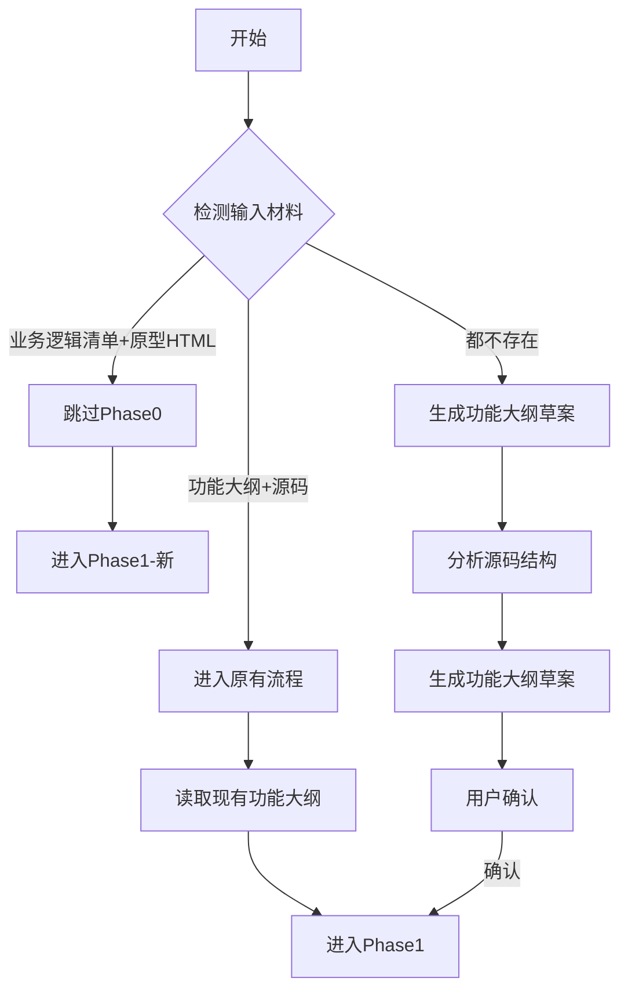
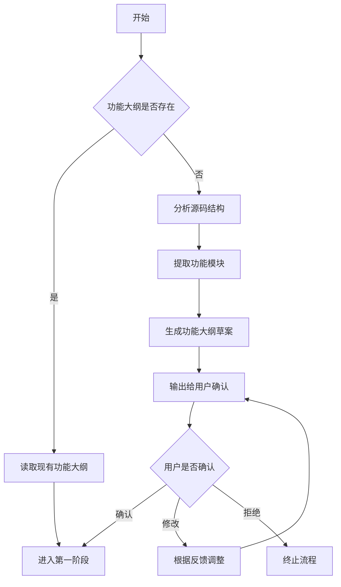

# 第零阶段：输入类型检测与功能大纲确认

## V3.0 新增：输入类型检测

当用户调用 prd-auto-generator 时，首先检测输入类型：



### 输入类型判断规则

| 输入类型 | 检测条件 | 执行流程 |
|----------|----------|----------|
| **业务逻辑清单+原型HTML** | 业务逻辑清单文件存在 + 原型HTML目录存在 | 跳过Phase0，进入Phase1-新 |
| **功能大纲+源码** | 功能大纲文件存在 + 源码目录存在 | 原有Phase0流程 |
| **无输入** | 都不存在 | 分析源码生成功能大纲草案 |

---

## 原有流程：功能大纲缺失时的处理



## 功能大纲缺失时的处理流程

1. **检测功能大纲**：检查 `docs/功能大纲.md` 或用户指定的功能大纲文件是否存在
2. **源码分析**：当功能大纲不存在时，自动分析目标源码，提取功能模块
3. **生成草案**：基于源码分析结果，生成功能大纲草案
4. **用户确认**：输出功能大纲给用户确认，用户可选择：
   - 确认：继续生成PRD
   - 修改：提供修改意见，调整后重新确认
   - 拒绝：终止流程

## 源码分析方法

| 源码类型 | 分析重点 | 提取内容 |
|----------|----------|----------|
| HTML文件 | DOM结构、事件绑定、弹窗组件 | 页面区域划分、功能入口、交互弹窗 |
| JavaScript | 状态变量、函数功能、事件处理 | 业务逻辑、数据流转、操作流程 |
| CSS | 类名语义、布局结构 | UI组件、页面布局 |
| 配置文件 | 组件定义、路由配置 | 功能模块、页面路由 |

## 功能大纲输出格式

```markdown
# {项目/模块名称}功能大纲（草案）

> 基于源码分析生成，请确认是否准确完整。
> 隐藏组件已排除，不在大纲中展示。

---

## 一、编辑器框架（或系统框架）

- 布局结构说明
- 主要区域划分

---

## 二、主页面管理

### 2.1 主页面列表
- 功能项列表

### 2.2 新建主页面
- 功能项列表

### 2.3 页面类型配置
| 页面类型 | 类型标识 | 可选模板 |
|----------|----------|----------|
| ... | ... | ... |

---

## 三、子页面管理

- 功能项列表

---

## 四、组件管理

### 4.1 组件库面板
- 组件分类Tab
- 组件点击添加到页面

### 4.2 {组件分类}组件列表
| 组件名称 | 组件标识 |
|----------|----------|
| ... | ... |

---

## 五、{组件名}配置面板

### 5.1 配置项
| 配置项名称 | 配置类型 | 可选值/说明 |
|------------|----------|-------------|
| ... | ... | ... |

### 5.2 {弹窗名称}弹窗（如有）
- 功能项列表

---

## 六、{组件名}配置面板
...

---

## N、页面布局管理

### N.1 布局列表
- 功能项列表

### N.2 默认组件
#### N.2.1 {默认组件名}
- 配置项列表

---

## N+1、业务规则摘要

| 规则编号 | 规则名称 | 适用场景 | 规则描述 |
|----------|----------|----------|----------|
| RULE-001 | ... | ... | ... |

---

## N+2、功能确认清单

| 序号 | 功能模块 | 数量 |
|------|----------|------|
| 1 | ... | ... |

---

## 请确认

1. **功能范围**：以上功能大纲是否完整覆盖主要功能？
2. **模块划分**：层级结构是否清晰合理？
3. **忽略区域**：是否有功能点不需要在PRD中详细描述？

请回复：
- **确认**：继续生成PRD文档
- **修改**：提供修改意见
- **补充**：补充遗漏的功能点
```

## 层级结构规范

| 层级 | 名称 | 说明 |
|------|------|------|
| 一级 | 功能大类 | 一、编辑器框架；二、主页面管理；三、子页面管理；四、组件管理 |
| 二级 | 功能模块/组件 | 五、商品列表配置面板；六、商品分组配置面板...（每个组件独立标题） |
| 三级 | 子功能 | 5.1 配置项；5.2 弹窗（如有） |
| 四级 | 功能点 | 具体配置项、操作项（使用表格呈现） |

## 大纲编写原则

1. 使用中文数字（一、二、三...）作为一级标题
2. 组件配置面板各自独立标题（五、六、七...），不合并
3. 配置项使用表格呈现：配置项名称、配置类型、可选值/说明
4. 弹窗作为子标题放在对应组件配置面板下
5. 组件库列表只展示组件名称和标识，详细配置在独立章节
6. 页面布局管理单独列出默认组件（如顶部导航、底部导航）
7. 隐藏组件明确排除，不在大纲中展示