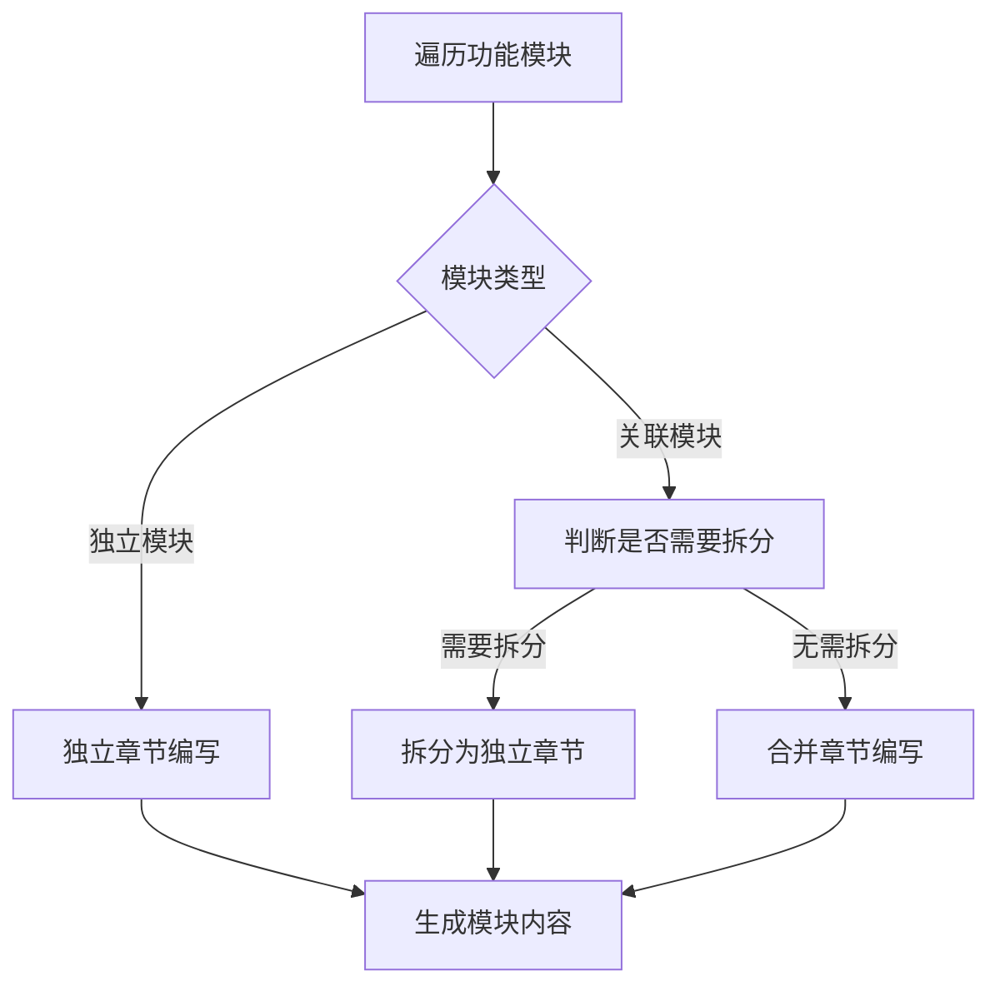

# 第二阶段：模块分析

遍历功能模块，判断是否需要拆分为独立章节。

## 执行流程

```mermaid
flowchart TD
    A[遍历功能模块] --> B{模块类型}
    B -->|独立模块| C[独立章节编写]
    B -->|关联模块| D[判断是否需要拆分]
    D -->|需要拆分| E[拆分为独立章节]
    D -->|无需拆分| F[合并章节编写]
    C --> G[生成模块内容]
    E --> G
    F --> G
```

## 拆分判断规则

- 若功能大纲中模块A和模块B并列且功能独立，应拆分为独立章节
- 若模块间存在强依赖关系，可合并为同一章节
- 例：图片库和视频库功能相似但独立，应拆分为两个独立章节