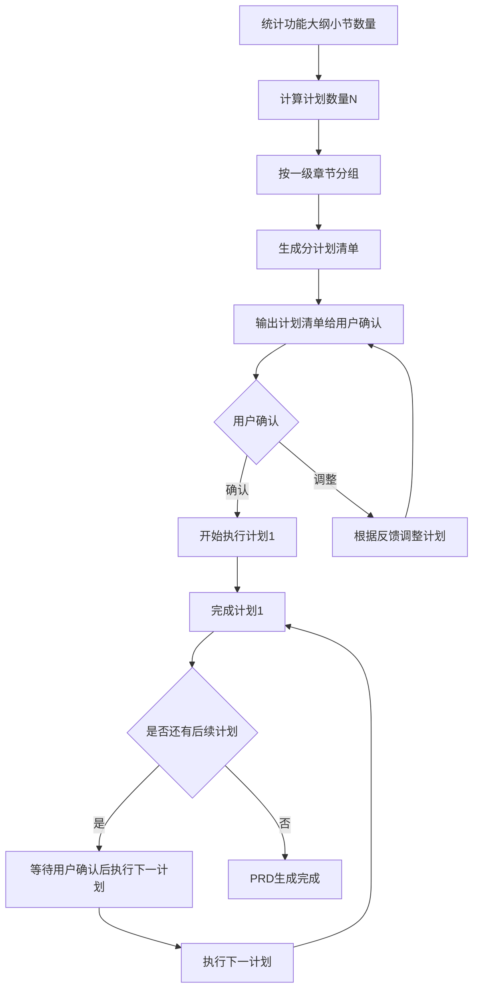

# 第2.5阶段：分计划执行

根据功能大纲小节数量计算计划数，分计划执行生成。

## 计划数量计算规则

- 计划数量 N = 功能大纲小节总数 ÷ 2（向上取整）
- 小节统计：统计功能大纲中所有二级标题（如2.1、2.2、5.1、5.2等）数量
- 分组原则：按一级章节分组，每组包含相近的功能模块

## 执行流程

## 分计划执行规则

1. 每完成一个计划后暂停，等待用户确认
2. 用户确认后继续执行下一计划
3. 如用户要求调整，根据反馈修改后继续
4. 所有计划完成后，输出完整PRD文档

## 计划分组示例

| 计划 | 内容 | 对应大纲章节 |
|------|------|-------------|
| 1 | 编辑器框架 | 一 |
| 2 | 主页面管理 | 二 |
| 3 | 子页面管理、组件管理 | 三、四 |
| 4 | 商品列表配置面板 | 五 |
| 5 | 商品分组配置面板 | 六 |
| ... | ... | ... |