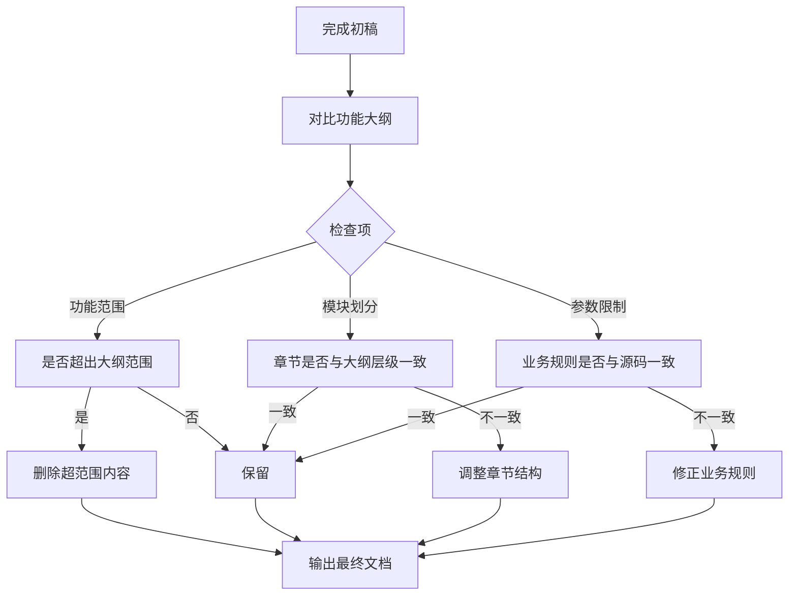

# 第四阶段：一致性检查

完成PRD初稿后，对比功能大纲进行一致性检查。

## 执行流程

## 检查项清单

### 功能范围检查
- [ ] 是否超出功能大纲范围
- [ ] 忽略区域是否未编写内容
- [ ] 并列模块是否已拆分为独立章节

### 模块划分检查
- [ ] 章节是否与大纲层级一致
- [ ] 页面章节是否有功能概述
- [ ] 五级标题是否有序号

### 参数限制检查
- [ ] 业务规则是否与源码实现一致
- [ ] 流程图分支与业务规则表格是否对应
- [ ] 错误提示文案是否与源码一致