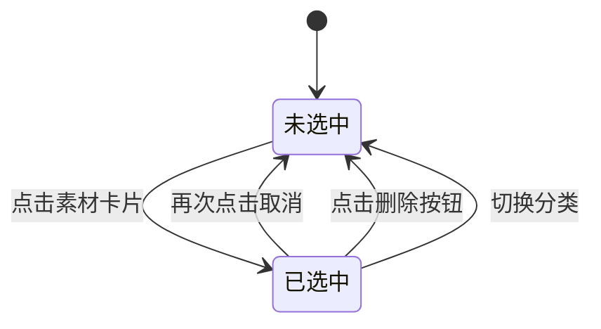

# 商城运营后台产品需求文档

# 1. 需求背景

---

# 2. 需求分析

---

# 3. 系统流程图

---

# 4. 详细需求

## 4.1. 商城运营后台系统

### 4.1.1. 素材库模块

#### 4.1.1.1. 图片库页面

##### 1. 功能概述

- **功能描述**：提供图片素材的统一管理能力，支持分类管理、图片上传、预览、移动、删除、复制等操作。
- **业务描述**：商家可通过图片库集中管理商城运营所需的图片资源，方便在页面装修时快速引用。
- **使用角色**：商家运营、店铺管理员。
- **触发条件**：商家需要上传、管理或使用图片素材时进入图片库。

##### 2. 界面设计

###### 2.1 页面原型

（待补充）

###### 2.2 输出项说明

| 字段名称 | 字段标识 | 数据类型 | 数据来源 | 格式说明 |
|----------|----------|----------|----------|----------|
| 图片ID | id | string | 系统生成 | UUID格式 |
| 图片URL | url | string | 上传服务 | 完整URL地址 |
| 文件大小 | size | number | 文件属性 | 字节数 |
| 图片尺寸 | dimensions | object | 文件属性 | {width, height} |
| 创建时间 | created_at | string | 系统生成 | YYYY-MM-DD HH:mm:ss |

##### 3. 业务逻辑

###### 3.1 流程图

**图片上传流程**

```mermaid
flowchart TD
    A[开始] --> B[进入图片库]
    B --> C[选择图片分类]
    C --> D[点击上传图片按钮]
    D --> E[打开上传弹窗]
    E --> F[选择目标分类]
    F --> G[选择或拖拽文件]
    G --> H{文件格式校验}
    H -->|不通过| I[提示"只能上传JPG、JPEG、PNG、GIF、WEBP格式的文件"]
    I --> G
    H -->|通过| J{文件大小校验}
    J -->|超过3MB| K[提示"文件大小不能超过3MB"]
    K --> G
    J -->|通过| L[添加到上传列表]
    L --> M[点击上传按钮]
    M --> N[生成素材ID]
    N --> O[创建本地预览URL]
    O --> P[保存素材信息]
    P --> Q[刷新素材列表]
    Q --> R[结束]
```

###### 3.2 业务规则

| 规则编号 | 规则名称 | 适用场景 | 规则描述 | 错误提示 |
|----------|----------|----------|----------|----------|
| RULE-IMG-001 | 图片格式限制 | 上传图片 | 仅支持JPG、JPEG、PNG、GIF、WEBP格式 | 只能上传JPG、JPEG、PNG、GIF、WEBP格式的文件 |
| RULE-IMG-002 | 图片大小限制 | 上传图片 | 单个图片文件不超过3MB | 文件大小不能超过3MB |
| RULE-IMG-003 | 分类层级限制 | 分类管理 | 分类最多支持二级 | 最多支持二级分类 |
| RULE-IMG-004 | 默认分类保护 | 分类删除 | 默认分类不可删除 | 默认分类不能删除 |

###### 3.3 状态机设计

**素材选中状态**



**状态定义表**

| 状态值 | 状态名称 | 状态说明 | 可见角色 |
|--------|----------|----------|----------|
| 0 | 未选中 | 素材未被选中 | 商家运营、店铺管理员 |
| 1 | 已选中 | 素材被选中，可进行操作 | 商家运营、店铺管理员 |

**状态对应UI差异表**

| 状态 | 选中框 | 操作按钮 | 样式 |
|------|--------|----------|------|
| 未选中 | 不显示 | 不显示 | 默认样式 |
| 已选中 | 显示勾选 | 显示删除、移动按钮 | 高亮边框 |

##### 4. 交互设计

###### 4.1 输入项说明

| 字段名称 | 字段标识 | 字段类型 | 必填 | 数据类型 | 长度限制 | 校验规则 | 取值范围 | 来源 | 提示文案 | 备注 |
|----------|----------|----------|------|----------|----------|----------|----------|------|----------|------|
| 分类名称 | category_name | 文本输入 | 是 | string | 1-20 | 不能包含特殊字符，同级不重复 | - | 用户输入 | 请输入分类名称 | - |
| 上级分类 | parent_id | 下拉选择 | 否 | string | - | 必须为已存在的分类ID | - | 系统分类树 | 请选择上级分类 | 为空则为一级分类 |
| 图片文件 | file | 文件上传 | 是 | file | - | 格式限制、大小≤3MB | JPG、JPEG、PNG、GIF、WEBP | 用户上传 | 请选择图片文件 | - |
| 图片名称 | name | 文本输入 | 是 | string | 1-100 | 不能包含特殊字符 | - | 用户输入/文件名 | 请输入图片名称 | 默认为文件名 |
| 所属分类 | category_id | 下拉选择 | 是 | string | - | 必须为已存在的分类ID | - | 系统分类树 | 请选择分类 | 默认当前选中分类 |

###### 4.2 交互说明

**页面布局**
1. 页面顶部为选项卡区域，包含"图片库"和"视频库"两个选项卡。
2. 左侧为分类树区域，宽度固定，显示图片分类结构。
3. 右侧为图片展示区域，包含操作栏、图片列表和分页组件。

**分类操作**
1. **选择分类**：点击分类节点，右侧显示该分类下的图片列表。
2. **新增分类**：点击分类树顶部的"+"按钮，或右键点击分类节点选择"新增子分类"。
3. **编辑分类**：点击分类节点的编辑图标，或右键选择"编辑分类名称"。
4. **删除分类**：点击分类节点的删除图标，或右键选择"删除分类"。

**图片操作**
1. **上传图片**：点击"上传图片"按钮，弹出上传弹窗。
2. **批量上传**：支持同时选择多个图片文件上传。
3. **选择图片**：点击图片卡片进行选中/取消选中，支持多选。
4. **预览图片**：点击图片卡片上的预览图标，打开预览弹窗。
5. **删除图片**：选中图片后点击"删除"按钮，确认后删除。
6. **移动图片**：选中图片后点击"移动"按钮，选择目标分类。
7. **复制链接**：点击图片卡片上的复制图标，将图片URL复制到剪贴板。

###### 4.3 错误提示文案

**表单校验提示**

| 校验字段 | 校验场景 | 提示文案 |
|----------|----------|----------|
| 分类名称 | 为空 | 请输入分类名称 |
| 分类名称 | 超长 | 分类名称不能超过20个字符 |
| 分类名称 | 重复 | 该分类名称已存在 |
| 图片文件 | 格式错误 | 只能上传JPG、JPEG、PNG、GIF、WEBP格式的文件 |
| 图片文件 | 大小超限 | 文件大小不能超过3MB |

**业务异常提示**

| 异常场景 | 错误码 | 提示文案 |
|----------|--------|----------|
| 默认分类删除 | IMG-001 | 默认分类不能删除 |
| 分类层级超限 | IMG-002 | 最多支持二级分类 |
| 上传失败 | IMG-003 | 上传失败，请重试 |

##### 5. 数据设计

###### 5.1 数据流转说明

**数据来源**

| 字段/数据 | 来源 | 获取方式 | 说明 |
|-----------|------|----------|------|
| 分类列表 | 分类管理模块 | API查询 | 完整分类树结构 |
| 图片文件 | 用户上传 | 文件上传服务 | 图片文件 |
| 图片URL | 文件服务 | 上传后返回 | CDN存储地址 |

**数据去向**

| 数据 | 目标系统/模块 | 同步时机 | 说明 |
|------|---------------|----------|------|
| 图片信息 | 页面装修模块 | 选择图片时 | 用于页面组件配置 |
| 图片URL | 剪贴板 | 复制链接时 | 用户手动粘贴使用 |

###### 5.2 数据权限设计

**角色数据范围**

| 角色 | 数据范围 | 说明 |
|------|----------|----------|
| 商家运营 | 本店铺图片 | 本店铺上传的所有图片 |
| 店铺管理员 | 本店铺图片 | 本店铺上传的所有图片 |

**功能权限点**

| 权限标识 | 权限名称 |
|----------|----------|
| image:view | 查看图片 |
| image:upload | 上传图片 |
| image:delete | 删除图片 |
| image:move | 移动图片 |
| category:create | 新建分类 |
| category:edit | 编辑分类 |
| category:delete | 删除分类 |

##### 6. 扩展功能

###### 6.1 批量操作规则

| 操作名称 | 单次上限 | 前置条件 | 成功提示 |
|----------|----------|----------|----------|
| 批量上传 | 20个文件 | 存储空间充足 | 上传成功 |
| 批量删除 | 50条 | 已选中图片 | 删除成功 |
| 批量移动 | 50条 | 已选中图片、目标分类存在 | 移动成功 |

###### 6.2 操作日志要求

| 操作类型 | 记录内容 | 保留时长 |
|----------|----------|----------|
| 上传 | 操作人、时间、图片名称、分类 | 3年 |
| 删除 | 操作人、时间、图片名称 | 3年 |
| 移动 | 操作人、时间、图片名称、原分类、目标分类 | 3年 |

---

#### 4.1.1.2. 视频库页面

##### 1. 功能概述

- **功能描述**：提供视频素材的统一管理能力，支持分类管理、视频上传、预览、移动、删除、复制等操作。
- **业务描述**：商家可通过视频库集中管理商城运营所需的视频资源，方便在页面装修时快速引用。
- **使用角色**：商家运营、店铺管理员。
- **触发条件**：商家需要上传、管理或使用视频素材时进入视频库。

##### 2. 界面设计

###### 2.1 页面原型

（待补充）

###### 2.2 输出项说明

| 字段名称 | 字段标识 | 数据类型 | 数据来源 | 格式说明 |
|----------|----------|----------|----------|----------|
| 视频ID | id | string | 系统生成 | UUID格式 |
| 视频URL | url | string | 上传服务 | 完整URL地址 |
| 缩略图URL | thumbnail | string | 上传服务 | 视频封面图 |
| 文件大小 | size | number | 文件属性 | 字节数 |
| 创建时间 | created_at | string | 系统生成 | YYYY-MM-DD HH:mm:ss |

##### 3. 业务逻辑

###### 3.1 流程图

**视频上传流程**

```mermaid
flowchart TD
    A[开始] --> B[进入视频库]
    B --> C[选择视频分类]
    C --> D[点击上传视频按钮]
    D --> E[打开上传弹窗]
    E --> F[选择目标分类]
    F --> G[选择或拖拽文件]
    G --> H{文件格式校验}
    H -->|不通过| I[提示"只能上传MP4、WMV、MOV格式的文件"]
    I --> G
    H -->|通过| J{文件大小校验}
    J -->|超过500MB| K[提示"文件大小不能超过500MB"]
    K --> G
    J -->|通过| L[添加到上传列表]
    L --> M[点击上传按钮]
    M --> N[生成素材ID]
    N --> O[提取视频缩略图]
    O --> P[保存素材信息]
    P --> Q[刷新素材列表]
    Q --> R[结束]
```

###### 3.2 业务规则

| 规则编号 | 规则名称 | 适用场景 | 规则描述 | 错误提示 |
|----------|----------|----------|----------|----------|
| RULE-VID-001 | 视频格式限制 | 上传视频 | 仅支持MP4、WMV、MOV格式 | 只能上传MP4、WMV、MOV格式的文件 |
| RULE-VID-002 | 视频大小限制 | 上传视频 | 单个视频文件不超过500MB | 文件大小不能超过500MB |
| RULE-VID-003 | 分类层级限制 | 分类管理 | 分类最多支持二级 | 最多支持二级分类 |
| RULE-VID-004 | 默认分类不显示 | 分类筛选 | 视频库不显示默认分类 | - |

###### 3.3 状态机设计

（与图片库相同，参考图片库状态机设计）

##### 4. 交互设计

###### 4.1 输入项说明

| 字段名称 | 字段标识 | 字段类型 | 必填 | 数据类型 | 长度限制 | 校验规则 | 取值范围 | 来源 | 提示文案 | 备注 |
|----------|----------|----------|------|----------|----------|----------|----------|------|----------|------|
| 视频文件 | file | 文件上传 | 是 | file | - | 格式限制、大小≤500MB | MP4、WMV、MOV | 用户上传 | 请选择视频文件 | - |
| 视频名称 | name | 文本输入 | 是 | string | 1-100 | 不能包含特殊字符 | - | 用户输入/文件名 | 请输入视频名称 | 默认为文件名 |
| 所属分类 | category_id | 下拉选择 | 是 | string | - | 必须为已存在的分类ID | - | 系统分类树 | 请选择分类 | 默认当前选中分类 |

###### 4.2 交互说明

**视频操作**
1. **上传视频**：点击"上传视频"按钮，弹出上传弹窗。
2. **批量上传**：支持同时选择多个视频文件上传。
3. **选择视频**：点击视频卡片进行选中/取消选中，支持多选。
4. **预览视频**：点击视频卡片上的预览图标，打开视频播放弹窗。
5. **删除视频**：选中视频后点击"删除"按钮，确认后删除。
6. **移动视频**：选中视频后点击"移动"按钮，选择目标分类。
7. **复制链接**：点击视频卡片上的复制图标，将视频URL复制到剪贴板。

###### 4.3 错误提示文案

**表单校验提示**

| 校验字段 | 校验场景 | 提示文案 |
|----------|----------|----------|
| 视频文件 | 格式错误 | 只能上传MP4、WMV、MOV格式的文件 |
| 视频文件 | 大小超限 | 文件大小不能超过500MB |

**业务异常提示**

| 异常场景 | 错误码 | 提示文案 |
|----------|--------|----------|
| 上传失败 | VID-001 | 上传失败，请重试 |
| 无可用分类 | VID-002 | 暂无视频分类，请先创建分类 |

##### 5. 数据设计

###### 5.1 数据流转说明

**数据来源**

| 字段/数据 | 来源 | 获取方式 | 说明 |
|-----------|------|----------|------|
| 分类列表 | 分类管理模块 | API查询 | 视频专用分类树 |
| 视频文件 | 用户上传 | 文件上传服务 | 视频文件 |
| 视频URL | 文件服务 | 上传后返回 | CDN存储地址 |

**数据去向**

| 数据 | 目标系统/模块 | 同步时机 | 说明 |
|------|---------------|----------|------|
| 视频信息 | 页面装修模块 | 选择视频时 | 用于页面组件配置 |
| 视频URL | 剪贴板 | 复制链接时 | 用户手动粘贴使用 |

###### 5.2 数据权限设计

（与图片库相同，参考图片库数据权限设计）

##### 6. 扩展功能

###### 6.1 批量操作规则

| 操作名称 | 单次上限 | 前置条件 | 成功提示 |
|----------|----------|----------|----------|
| 批量上传 | 10个文件 | 存储空间充足 | 上传成功 |
| 批量删除 | 50条 | 已选中视频 | 删除成功 |
| 批量移动 | 50条 | 已选中视频、目标分类存在 | 移动成功 |

###### 6.2 操作日志要求

| 操作类型 | 记录内容 | 保留时长 |
|----------|----------|----------|
| 上传 | 操作人、时间、视频名称、分类 | 3年 |
| 删除 | 操作人、时间、视频名称 | 3年 |
| 移动 | 操作人、时间、视频名称、原分类、目标分类 | 3年 |

---

### 4.1.2. 页面装修模块

#### 4.1.2.1. 配置面板页面

##### 1. 功能概述

- **功能描述**：在页面装修的配置面板中，为图片广告等组件提供选择图片和选择视频的弹窗功能。
- **业务描述**：商家在配置页面组件时，可通过弹窗从素材库中选择图片或视频素材。
- **使用角色**：商家运营、店铺管理员。
- **触发条件**：在配置面板中点击"添加图片"或"添加视频"按钮。

##### 2. 界面设计

###### 2.1 页面原型

（待补充）

###### 2.2 输出项说明

| 字段名称 | 字段标识 | 数据类型 | 数据来源 | 格式说明 |
|----------|----------|----------|----------|----------|
| 选中素材ID | material_id | string | 用户选择 | 素材唯一标识 |
| 素材URL | url | string | 素材库 | 完整URL地址 |
| 素材名称 | name | string | 素材库 | 素材文件名 |
| 缩略图URL | thumbnail | string | 素材库 | 视频封面（视频素材） |

##### 3. 业务逻辑

###### 3.1 流程图

**选择素材流程**

```mermaid
flowchart TD
    A[开始] --> B[点击添加素材按钮]
    B --> C[打开选择素材弹窗]
    C --> D[加载素材库数据]
    D --> E{筛选方式}
    E -->|关键词搜索| F[输入搜索词]
    E -->|分类筛选| G[选择分类]
    F --> H[更新素材列表]
    G --> H
    H --> I[浏览筛选结果]
    I --> J[点击选择素材]
    J --> K{已选中?}
    K -->|是| L[取消选中]
    K -->|否| M[标记选中]
    L --> I
    M --> N[点击确定]
    N --> O{是否已选择素材}
    O -->|否| P[提示"请选择要添加的素材"]
    P --> I
    O -->|是| Q[关闭弹窗]
    Q --> R[素材添加到组件]
    R --> S[结束]
```

###### 3.2 业务规则

| 规则编号 | 规则名称 | 适用场景 | 规则描述 | 错误提示 |
|----------|----------|----------|----------|----------|
| RULE-SEL-001 | 图片尺寸建议 | 选择图片 | 建议图片宽度750px，高度不限 | 建议图片尺寸宽度750 |
| RULE-SEL-002 | 视频格式建议 | 选择视频 | 建议视频宽度750px，支持MP4格式 | 支持MP4格式 |
| RULE-SEL-003 | 单选限制 | 素材选择 | 每次仅能选择一个素材 | - |
| RULE-SEL-004 | 类型隔离 | 弹窗显示 | 选择图片弹窗仅显示图片，选择视频弹窗仅显示视频 | - |

###### 3.3 状态机设计

（无状态流转，无需状态机设计）

##### 4. 交互设计

###### 4.1 输入项说明

| 字段名称 | 字段标识 | 字段类型 | 必填 | 数据类型 | 长度限制 | 校验规则 | 取值范围 | 来源 | 提示文案 | 备注 |
|----------|----------|----------|------|----------|----------|----------|----------|------|----------|------|
| 搜索关键词 | keyword | 文本输入 | 否 | string | 0-50 | - | - | 用户输入 | 搜索素材名称 | 模糊匹配 |
| 分类筛选 | category | 下拉选择 | 否 | string | - | - | 全部分类+素材分类 | 素材库分类 | 选择分类 | - |
| 选中素材 | selected_id | 点击选择 | 是 | string | - | - | 已有素材ID | 素材库 | - | 单选 |

###### 4.2 交互说明

**选择图片弹窗**
1. **打开弹窗**：在配置面板点击"添加图片"区域。
2. **搜索筛选**：在搜索框输入关键词，按图片名称模糊搜索。
3. **分类筛选**：通过下拉选择图片分类进行筛选。
4. **选择图片**：点击图片卡片选中，再次点击取消选中（单选）。
5. **确认选择**：点击"确定"按钮，将选中的图片添加到组件配置。
6. **取消操作**：点击"取消"按钮关闭弹窗。

**选择视频弹窗**
1. **打开弹窗**：在配置面板点击"添加视频"区域。
2. **搜索筛选**：在搜索框输入关键词，按视频名称模糊搜索。
3. **分类筛选**：通过下拉选择视频分类进行筛选。
4. **选择视频**：点击视频卡片选中，再次点击取消选中（单选）。
5. **确认选择**：点击"确定"按钮，将选中的视频添加到组件配置。
6. **取消操作**：点击"取消"按钮关闭弹窗。

###### 4.3 错误提示文案

**表单校验提示**

| 校验字段 | 校验场景 | 提示文案 |
|----------|----------|----------|
| 素材 | 未选择 | 请选择要添加的素材 |

**业务异常提示**

| 异常场景 | 错误码 | 提示文案 |
|----------|--------|----------|
| 图片为空 | SEL-001 | 暂无图片素材 |
| 视频为空 | SEL-002 | 暂无视频素材 |

##### 5. 数据设计

###### 5.1 数据流转说明

**数据来源**

| 字段/数据 | 来源 | 获取方式 | 说明 |
|-----------|------|----------|------|
| 图片列表 | 图片库模块 | API查询 | 图片素材列表 |
| 视频列表 | 视频库模块 | API查询 | 视频素材列表 |
| 分类数据 | 素材库模块 | API查询 | 图片/视频分类选项 |

**数据去向**

| 数据 | 目标系统/模块 | 同步时机 | 说明 |
|------|---------------|----------|------|
| 选中素材 | 组件配置 | 确认选择时 | 更新组件的图片/视频配置 |

###### 5.2 数据权限设计

**模块依赖关系**

| 模块名称 | 依赖场景 | 依赖数据 | 是否强依赖 |
|----------|----------|----------|------------|
| 图片库 | 选择图片弹窗 | 图片列表、图片分类 | 是 |
| 视频库 | 选择视频弹窗 | 视频列表、视频分类 | 是 |

##### 6. 扩展功能

###### 6.1 批量操作规则

（不适用）

###### 6.2 操作日志要求

（不适用）

---

# 5. 非功能需求

## 5.1. 性能需求

| 指标名称 | 指标要求 |
|----------|----------|
| 页面加载时间 | 首屏加载 ≤ 3秒 |
| 素材列表加载 | 100条数据 ≤ 1秒 |
| 图片上传响应 | 3MB图片 ≤ 5秒 |
| 视频上传响应 | 500MB视频 ≤ 60秒 |
| 操作响应时间 | 普通操作 ≤ 500ms |

## 5.2. 兼容性需求

| 类型 | 要求 |
|------|------|
| 浏览器 | Chrome 80+、Firefox 75+、Safari 13+、Edge 80+ |
| 分辨率 | 最低支持1366×768，推荐1920×1080 |

## 5.3. 安全需求

| 安全项 | 要求 |
|--------|------|
| 文件上传 | 校验文件类型和大小，防止恶意文件上传 |
| 权限控制 | 基于角色的访问控制，防止越权操作 |
| 数据隔离 | 店铺数据相互隔离，防止数据泄露 |

---

# 6. 附录

## 6.1. 术语表

| 术语 | 说明 |
|------|------|
| 图片库 | 集中管理图片素材资源的模块 |
| 视频库 | 集中管理视频素材资源的模块 |
| 页面装修 | 可视化编辑商城页面的功能模块 |
| 配置面板 | 页面装修中用于配置组件属性的区域 |
| 分类树 | 层级化的素材分类管理结构 |

## 6.2. 相关文档

| 文档名称 | 文档路径 |
|----------|----------|
| 功能大纲 | docs/功能大纲.md |
| 需求文档规范 | references/prd-template-specification.md |

---

# 7. 版本记录

| 版本号 | 修改日期 | 修改人 | 修改内容 |
|--------|----------|--------|----------|
| V1.0 | 2026-03-18 | 产品经理 | 初稿创建 |
| V1.1 | 2026-03-18 | 产品经理 | 根据功能大纲复核：1.将视频库独立为单独章节；2.页面装修仅保留配置面板素材选择功能；3.修正分类层级为二级；4.采用三级层次结构规范 |