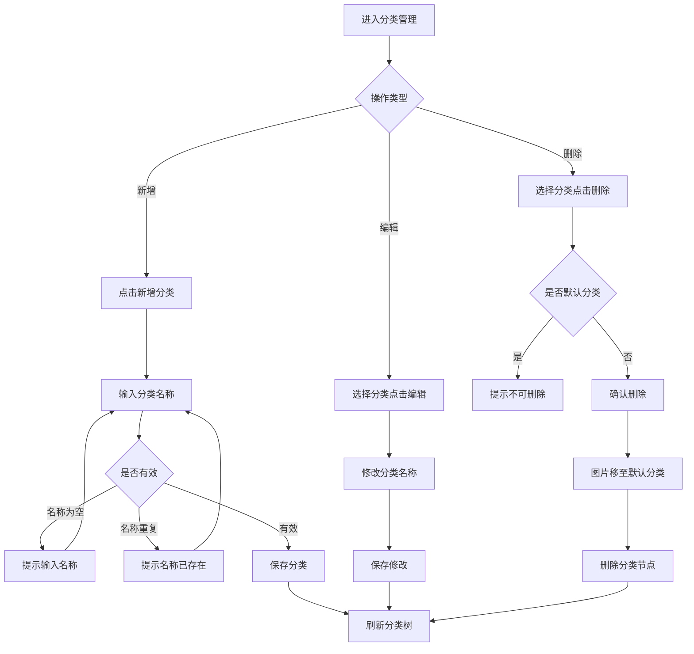
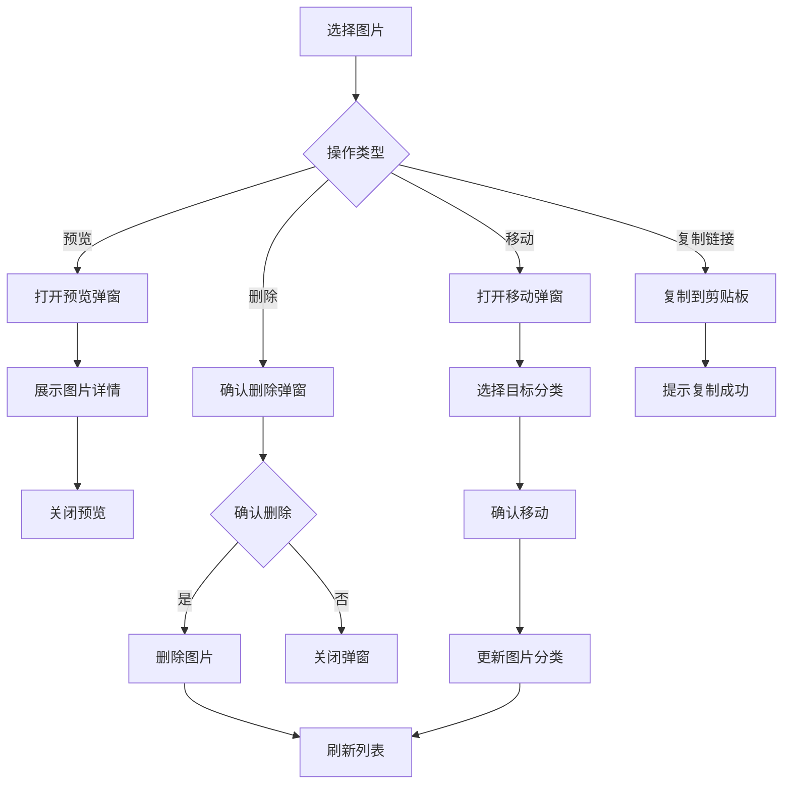
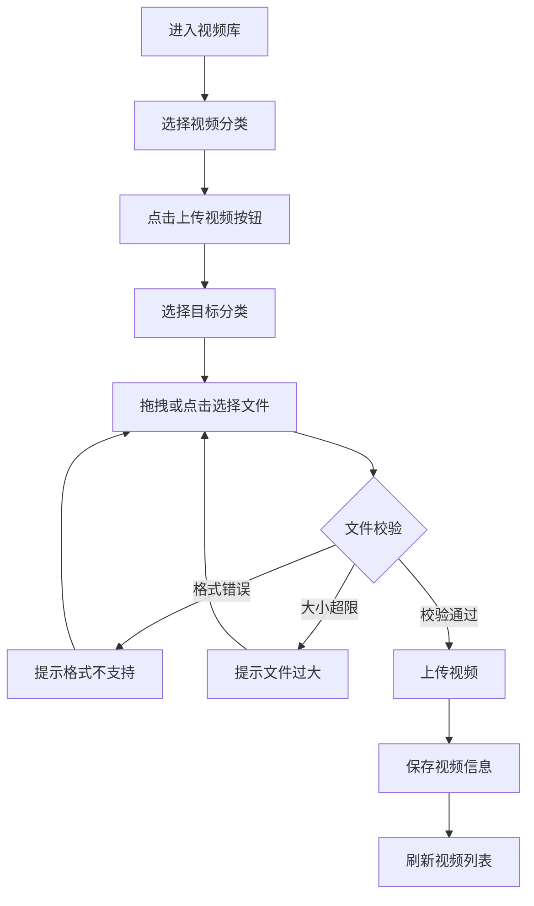
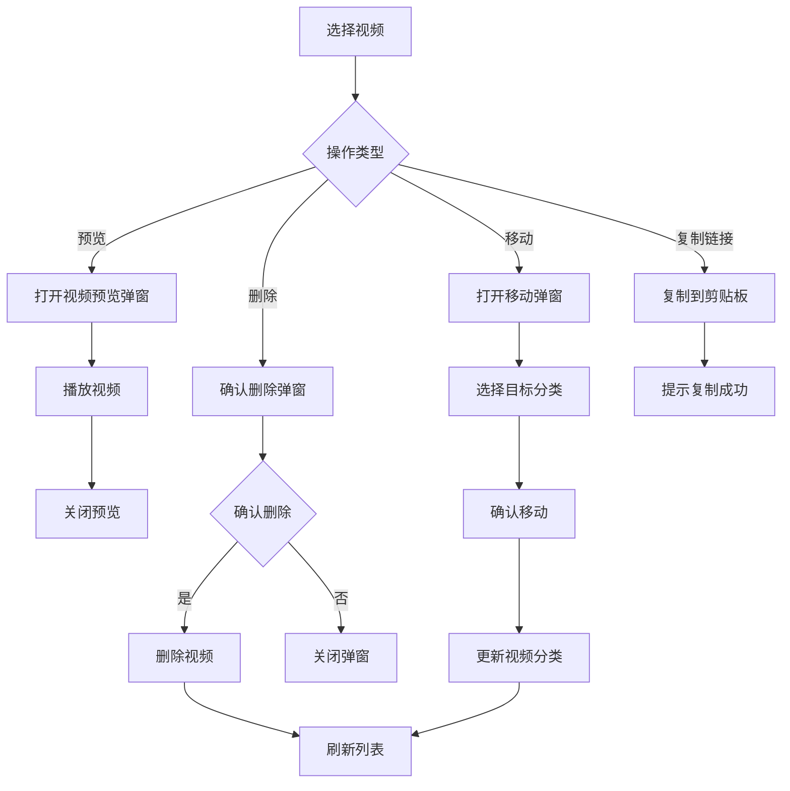
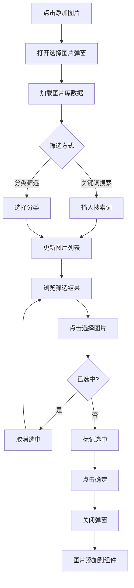
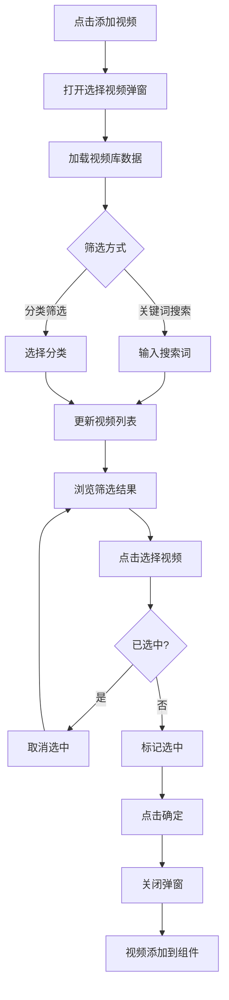

# 商城运营后台产品需求文档

## 一、文档信息

| 项目名称 | 商城运营后台 |
|---------|-------------|
| 文档版本 | V1.1 |
| 创建日期 | 2026-03-18 |
| 文档状态 | 修订稿 |
| 编写人员 | 产品经理 |

---

## 二、产品概述

### 2.1 产品背景
商城运营后台是为电商商家提供的一站式运营管理平台，帮助商家高效管理素材资源和自定义装修商城页面，提升运营效率和用户体验。

### 2.2 产品目标
- 提供统一的素材管理能力，支持图片、视频的分类存储与快速检索
- 实现可视化的页面装修功能，降低商家的技术门槛
- 提升商城运营效率，缩短页面更新周期

### 2.3 用户角色
| 角色 | 描述 | 主要职责 |
|------|------|----------|
| 商家运营 | 电商店铺运营人员 | 素材上传管理、页面装修配置 |
| 店铺管理员 | 店铺管理负责人 | 审核素材、管理分类结构 |

---

## 三、功能描述

# 3.1 图片库

## 3.1.1 功能概述
- **功能描述**：提供图片素材的统一管理能力，支持分类管理、图片上传、预览、移动、删除、复制等操作
- **业务描述**：商家可通过图片库集中管理商城运营所需的图片资源，方便在页面装修时快速引用
- **使用角色**：商家运营、店铺管理员
- **触发条件**：商家需要上传、管理或使用图片素材时进入图片库

## 3.1.2 流程图

### 图片上传流程

### 分类管理流程

### 图片操作流程

## 3.1.3 页面原型
- 图片库页面采用左右分栏布局
- 左侧为分类树，右侧为图片列表
- 顶部为选项卡切换图片库/视频库

## 3.1.4 输入项说明

### 分类信息
| 字段名称 | 字段标识 | 字段类型 | 必填 | 数据类型 | 长度限制 | 校验规则 | 取值范围 | 来源 | 提示文案 | 备注 |
|----------|----------|----------|------|----------|----------|----------|----------|------|----------|------|
| 分类名称 | category_name | 文本输入 | 是 | String | 1-20 | 不能包含特殊字符，同级不重复 | - | 用户输入 | 请输入分类名称 | - |
| 上级分类 | parent_id | 下拉选择 | 否 | String | - | 必须为已存在的分类ID | - | 系统分类树 | 请选择上级分类 | 为空则为一级分类 |

### 图片信息
| 字段名称 | 字段标识 | 字段类型 | 必填 | 数据类型 | 长度限制 | 校验规则 | 取值范围 | 来源 | 提示文案 | 备注 |
|----------|----------|----------|------|----------|----------|----------|----------|------|----------|------|
| 图片文件 | file | 文件上传 | 是 | File | - | 格式限制、大小≤3MB | - | 用户上传 | 请选择图片文件 | - |
| 图片名称 | name | 文本输入 | 是 | String | 1-100 | 不能包含特殊字符 | - | 用户输入/文件名 | 请输入图片名称 | 默认为文件名 |
| 所属分类 | category_id | 下拉选择 | 是 | String | - | 必须为已存在的分类ID | - | 系统分类树 | 请选择分类 | 默认当前选中分类 |

## 3.1.5 输出项说明

| 字段名称 | 字段标识 | 数据类型 | 数据来源 | 格式说明 |
|----------|----------|----------|----------|----------|
| 图片ID | id | String | 系统生成 | UUID格式 |
| 图片URL | url | String | 上传服务 | 完整URL地址 |
| 文件大小 | size | Number | 文件属性 | 字节数 |
| 图片尺寸 | dimensions | Object | 文件属性 | {width, height} |
| 创建时间 | created_at | String | 系统生成 | YYYY-MM-DD HH:mm:ss |

## 3.1.6 业务规则

| 规则编号 | 规则名称 | 适用场景 | 规则描述 | 错误提示 |
|----------|----------|----------|----------|----------|
| IMG-001 | 图片格式校验 | 图片上传 | 仅支持JPG、JPEG、PNG、GIF、WEBP格式 | 只能上传JPG、JPEG、PNG、GIF、WEBP格式的文件 |
| IMG-002 | 图片大小限制 | 图片上传 | 单个图片文件不超过3MB | 文件大小不能超过3MB |
| IMG-003 | 分类层级限制 | 分类管理 | 分类最多支持二级 | 最多支持二级分类 |
| IMG-004 | 默认分类保护 | 分类删除 | 默认分类不可删除 | 默认分类不能删除 |
| IMG-005 | 素材分类迁移 | 分类删除 | 删除分类时，其下图片移至默认分类 | 删除后，其下图片将移至"默认分类" |
| IMG-006 | 分类名称唯一 | 分类新增/编辑 | 同一层级分类名称不能重复 | 该分类名称已存在 |
| IMG-007 | 默认分类显示 | 分类筛选 | 默认分类仅在图片库显示 | - |

## 3.1.7 交互说明

### 页面布局
1. 页面顶部为选项卡区域，包含"图片库"和"视频库"两个选项卡
2. 左侧为分类树区域，宽度固定，显示图片分类结构
3. 右侧为图片展示区域，包含操作栏、图片列表和分页组件

### 分类操作
1. **选择分类**：点击分类节点，右侧显示该分类下的图片列表
2. **新增分类**：点击分类树顶部的"+"按钮，或右键点击分类节点选择"新增子分类"
3. **编辑分类**：点击分类节点的编辑图标，或右键选择"编辑分类名称"
4. **删除分类**：点击分类节点的删除图标，或右键选择"删除分类"

### 图片操作
1. **上传图片**：点击"上传图片"按钮，弹出上传弹窗
2. **批量上传**：支持同时选择多个图片文件上传
3. **选择图片**：点击图片卡片进行选中/取消选中，支持多选
4. **预览图片**：点击图片卡片上的预览图标，打开预览弹窗
5. **删除图片**：选中图片后点击"删除"按钮，确认后删除
6. **移动图片**：选中图片后点击"移动"按钮，选择目标分类
7. **复制链接**：点击图片卡片上的复制图标，将图片URL复制到剪贴板
8. **搜索图片**：在搜索框输入关键词，按图片名称模糊搜索

### 视图切换
1. 支持列表视图和网格视图切换
2. 默认展示网格视图

### 分页操作
1. 支持切换每页显示数量：10/20/50/100条
2. 支持快速跳转到指定页码

## 3.1.8 数据流转说明

### 数据来源
| 字段/数据 | 来源 | 获取方式 | 说明 |
|-----------|------|----------|------|
| 分类列表 | 分类管理模块 | API查询 | 完整分类树结构 |
| 图片文件 | 用户上传 | 文件上传服务 | 图片文件 |
| 图片URL | 文件服务 | 上传后返回 | CDN存储地址 |

### 数据去向
| 数据 | 目标系统/模块 | 同步时机 | 说明 |
|------|---------------|----------|------|
| 图片信息 | 页面装修模块 | 选择图片时 | 用于页面组件配置 |
| 图片URL | 剪贴板 | 复制链接时 | 用户手动粘贴使用 |

## 3.1.9 错误提示文案

### 表单校验提示
| 校验字段 | 校验场景 | 提示文案 |
|----------|----------|----------|
| 分类名称 | 为空 | 请输入分类名称 |
| 分类名称 | 超长 | 分类名称不能超过20个字符 |
| 分类名称 | 重复 | 该分类名称已存在 |
| 图片文件 | 格式错误 | 只能上传JPG、JPEG、PNG、GIF、WEBP格式的文件 |
| 图片文件 | 大小超限 | 文件大小不能超过3MB |

### 业务异常提示
| 异常场景 | 错误码 | 提示文案 |
|----------|--------|----------|
| 默认分类删除 | IMG-001 | 默认分类不能删除 |
| 分类层级超限 | IMG-002 | 最多支持二级分类 |
| 上传失败 | IMG-003 | 上传失败，请重试 |

## 3.1.10 批量操作规则

| 操作名称 | 单次上限 | 前置条件 | 成功提示 |
|----------|----------|----------|----------|
| 批量上传 | 20个文件 | 存储空间充足 | 上传成功 |
| 批量删除 | 50条 | 已选中图片 | 删除成功 |
| 批量移动 | 50条 | 已选中图片、目标分类存在 | 移动成功 |

---

# 3.2 视频库

## 3.2.1 功能概述
- **功能描述**：提供视频素材的统一管理能力，支持分类管理、视频上传、预览、移动、删除、复制等操作
- **业务描述**：商家可通过视频库集中管理商城运营所需的视频资源，方便在页面装修时快速引用
- **使用角色**：商家运营、店铺管理员
- **触发条件**：商家需要上传、管理或使用视频素材时进入视频库

## 3.2.2 流程图

### 视频上传流程

### 视频操作流程

## 3.2.3 页面原型
- 视频库与图片库共用页面，通过顶部选项卡切换
- 左侧为分类树，右侧为视频列表
- 视频以缩略图形式展示

## 3.2.4 输入项说明

### 分类信息
| 字段名称 | 字段标识 | 字段类型 | 必填 | 数据类型 | 长度限制 | 校验规则 | 取值范围 | 来源 | 提示文案 | 备注 |
|----------|----------|----------|------|----------|----------|----------|----------|------|----------|------|
| 分类名称 | category_name | 文本输入 | 是 | String | 1-20 | 不能包含特殊字符，同级不重复 | - | 用户输入 | 请输入分类名称 | - |
| 上级分类 | parent_id | 下拉选择 | 否 | String | - | 必须为已存在的分类ID | - | 系统分类树 | 请选择上级分类 | 为空则为一级分类 |

### 视频信息
| 字段名称 | 字段标识 | 字段类型 | 必填 | 数据类型 | 长度限制 | 校验规则 | 取值范围 | 来源 | 提示文案 | 备注 |
|----------|----------|----------|------|----------|----------|----------|----------|------|----------|------|
| 视频文件 | file | 文件上传 | 是 | File | - | 格式限制、大小≤500MB | - | 用户上传 | 请选择视频文件 | - |
| 视频名称 | name | 文本输入 | 是 | String | 1-100 | 不能包含特殊字符 | - | 用户输入/文件名 | 请输入视频名称 | 默认为文件名 |
| 所属分类 | category_id | 下拉选择 | 是 | String | - | 必须为已存在的分类ID | - | 系统分类树 | 请选择分类 | 默认当前选中分类 |

## 3.2.5 输出项说明

| 字段名称 | 字段标识 | 数据类型 | 数据来源 | 格式说明 |
|----------|----------|----------|----------|----------|
| 视频ID | id | String | 系统生成 | UUID格式 |
| 视频URL | url | String | 上传服务 | 完整URL地址 |
| 缩略图URL | thumbnail | String | 上传服务 | 视频封面图 |
| 文件大小 | size | Number | 文件属性 | 字节数 |
| 创建时间 | created_at | String | 系统生成 | YYYY-MM-DD HH:mm:ss |

## 3.2.6 业务规则

| 规则编号 | 规则名称 | 适用场景 | 规则描述 | 错误提示 |
|----------|----------|----------|----------|----------|
| VID-001 | 视频格式校验 | 视频上传 | 仅支持MP4、WMV、MOV格式 | 只能上传MP4、WMV、MOV格式的文件 |
| VID-002 | 视频大小限制 | 视频上传 | 单个视频文件不超过500MB | 文件大小不能超过500MB |
| VID-003 | 分类层级限制 | 分类管理 | 分类最多支持二级 | 最多支持二级分类 |
| VID-004 | 默认分类不显示 | 分类筛选 | 视频库不显示默认分类 | - |

## 3.2.7 交互说明

### 视频操作
1. **上传视频**：点击"上传视频"按钮，弹出上传弹窗
2. **批量上传**：支持同时选择多个视频文件上传
3. **选择视频**：点击视频卡片进行选中/取消选中，支持多选
4. **预览视频**：点击视频卡片上的预览图标，打开视频播放弹窗
5. **删除视频**：选中视频后点击"删除"按钮，确认后删除
6. **移动视频**：选中视频后点击"移动"按钮，选择目标分类
7. **复制链接**：点击视频卡片上的复制图标，将视频URL复制到剪贴板
8. **搜索视频**：在搜索框输入关键词，按视频名称模糊搜索

### 视图切换
1. 支持列表视图和网格视图切换
2. 默认展示网格视图

### 分页操作
1. 支持切换每页显示数量：10/20/50/100条
2. 支持快速跳转到指定页码
3. 视频库分页状态与图片库相互独立

## 3.2.8 数据流转说明

### 数据来源
| 字段/数据 | 来源 | 获取方式 | 说明 |
|-----------|------|----------|------|
| 分类列表 | 分类管理模块 | API查询 | 视频专用分类树 |
| 视频文件 | 用户上传 | 文件上传服务 | 视频文件 |
| 视频URL | 文件服务 | 上传后返回 | CDN存储地址 |

### 数据去向
| 数据 | 目标系统/模块 | 同步时机 | 说明 |
|------|---------------|----------|------|
| 视频信息 | 页面装修模块 | 选择视频时 | 用于页面组件配置 |
| 视频URL | 剪贴板 | 复制链接时 | 用户手动粘贴使用 |

## 3.2.9 错误提示文案

### 表单校验提示
| 校验字段 | 校验场景 | 提示文案 |
|----------|----------|----------|
| 视频文件 | 格式错误 | 只能上传MP4、WMV、MOV格式的文件 |
| 视频文件 | 大小超限 | 文件大小不能超过500MB |

### 业务异常提示
| 异常场景 | 错误码 | 提示文案 |
|----------|--------|----------|
| 上传失败 | VID-001 | 上传失败，请重试 |
| 无可用分类 | VID-002 | 暂无视频分类，请先创建分类 |

## 3.2.10 批量操作规则

| 操作名称 | 单次上限 | 前置条件 | 成功提示 |
|----------|----------|----------|----------|
| 批量上传 | 10个文件 | 存储空间充足 | 上传成功 |
| 批量删除 | 50条 | 已选中视频 | 删除成功 |
| 批量移动 | 50条 | 已选中视频、目标分类存在 | 移动成功 |

---

# 3.3 页面装修-配置面板素材选择

## 3.3.1 功能概述
- **功能描述**：在页面装修的配置面板中，为图片广告等组件提供选择图片和选择视频的弹窗功能
- **业务描述**：商家在配置页面组件时，可通过弹窗从素材库中选择图片或视频素材
- **使用角色**：商家运营、店铺管理员
- **触发条件**：在配置面板中点击"添加图片"或"添加视频"按钮

## 3.3.2 流程图

### 选择图片弹窗流程

### 选择视频弹窗流程

## 3.3.3 页面原型
- 弹窗标题分别为"选择图片素材"和"选择视频素材"
- 弹窗顶部包含搜索框和分类下拉选择
- 弹窗主体为素材网格列表
- 弹窗底部包含"确定"和"取消"按钮

## 3.3.4 输入项说明

### 选择图片弹窗
| 字段名称 | 字段标识 | 字段类型 | 必填 | 数据类型 | 长度限制 | 校验规则 | 取值范围 | 来源 | 提示文案 | 备注 |
|----------|----------|----------|------|----------|----------|----------|----------|------|----------|------|
| 搜索关键词 | keyword | 文本输入 | 否 | String | 0-50 | - | - | 用户输入 | 搜索图片名称 | 模糊匹配 |
| 分类筛选 | category | 下拉选择 | 否 | String | - | - | 全部分类+图片分类 | 图片库分类 | 选择分类 | - |
| 选中图片 | selected_id | 点击选择 | 是 | String | - | - | 已有图片ID | 图片库 | - | 单选 |

### 选择视频弹窗
| 字段名称 | 字段标识 | 字段类型 | 必填 | 数据类型 | 长度限制 | 校验规则 | 取值范围 | 来源 | 提示文案 | 备注 |
|----------|----------|----------|------|----------|----------|----------|----------|------|----------|------|
| 搜索关键词 | keyword | 文本输入 | 否 | String | 0-50 | - | - | 用户输入 | 搜索视频名称 | 模糊匹配 |
| 分类筛选 | category | 下拉选择 | 否 | String | - | - | 全部分类+视频分类 | 视频库分类 | 选择分类 | - |
| 选中视频 | selected_id | 点击选择 | 是 | String | - | - | 已有视频ID | 视频库 | - | 单选 |

## 3.3.5 输出项说明

| 字段名称 | 字段标识 | 数据类型 | 数据来源 | 格式说明 |
|----------|----------|----------|----------|----------|
| 选中素材ID | material_id | String | 用户选择 | 素材唯一标识 |
| 素材URL | url | String | 素材库 | 完整URL地址 |
| 素材名称 | name | String | 素材库 | 素材文件名 |
| 缩略图URL | thumbnail | String | 素材库 | 视频封面（视频素材） |

## 3.3.6 业务规则

| 规则编号 | 规则名称 | 适用场景 | 规则描述 | 错误提示 |
|----------|----------|----------|----------|----------|
| SEL-001 | 图片尺寸建议 | 选择图片 | 建议图片宽度750px，高度不限 | 建议图片尺寸宽度750 |
| SEL-002 | 视频格式建议 | 选择视频 | 建议视频宽度750px，支持MP4格式 | 支持MP4格式 |
| SEL-003 | 单选限制 | 素材选择 | 每次仅能选择一个素材 | - |
| SEL-004 | 类型隔离 | 弹窗显示 | 选择图片弹窗仅显示图片，选择视频弹窗仅显示视频 | - |

## 3.3.7 交互说明

### 选择图片弹窗
1. **打开弹窗**：在配置面板点击"添加图片"区域
2. **搜索筛选**：在搜索框输入关键词，按图片名称模糊搜索
3. **分类筛选**：通过下拉选择图片分类进行筛选
4. **选择图片**：点击图片卡片选中，再次点击取消选中（单选）
5. **确认选择**：点击"确定"按钮，将选中的图片添加到组件配置
6. **取消操作**：点击"取消"按钮关闭弹窗

### 选择视频弹窗
1. **打开弹窗**：在配置面板点击"添加视频"区域
2. **搜索筛选**：在搜索框输入关键词，按视频名称模糊搜索
3. **分类筛选**：通过下拉选择视频分类进行筛选
4. **选择视频**：点击视频卡片选中，再次点击取消选中（单选）
5. **确认选择**：点击"确定"按钮，将选中的视频添加到组件配置
6. **取消操作**：点击"取消"按钮关闭弹窗

## 3.3.8 数据流转说明

### 数据来源
| 字段/数据 | 来源 | 获取方式 | 说明 |
|-----------|------|----------|------|
| 图片列表 | 图片库模块 | API查询 | 图片素材列表 |
| 视频列表 | 视频库模块 | API查询 | 视频素材列表 |
| 分类数据 | 素材库模块 | API查询 | 图片/视频分类选项 |

### 数据去向
| 数据 | 目标系统/模块 | 同步时机 | 说明 |
|------|---------------|----------|------|
| 选中素材 | 组件配置 | 确认选择时 | 更新组件的图片/视频配置 |

## 3.3.9 错误提示文案

### 表单校验提示
| 校验字段 | 校验场景 | 提示文案 |
|----------|----------|----------|
| 素材 | 未选择 | 请选择要添加的素材 |

### 业务异常提示
| 异常场景 | 错误码 | 提示文案 |
|----------|--------|----------|
| 图片为空 | SEL-001 | 暂无图片素材 |
| 视频为空 | SEL-002 | 暂无视频素材 |

## 3.3.10 模块依赖关系

### 依赖的其他模块
| 模块名称 | 依赖场景 | 依赖数据 | 是否强依赖 |
|----------|----------|----------|------------|
| 图片库 | 选择图片弹窗 | 图片列表、图片分类 | 是 |
| 视频库 | 选择视频弹窗 | 视频列表、视频分类 | 是 |

---

## 四、非功能需求

### 4.1 性能需求
| 指标名称 | 指标要求 |
|----------|----------|
| 页面加载时间 | 首屏加载 ≤ 3秒 |
| 素材列表加载 | 100条数据 ≤ 1秒 |
| 图片上传响应 | 3MB图片 ≤ 5秒 |
| 视频上传响应 | 500MB视频 ≤ 60秒 |
| 操作响应时间 | 普通操作 ≤ 500ms |

### 4.2 兼容性需求
| 类型 | 要求 |
|------|------|
| 浏览器 | Chrome 80+、Firefox 75+、Safari 13+、Edge 80+ |
| 分辨率 | 最低支持1366×768，推荐1920×1080 |

### 4.3 安全需求
| 安全项 | 要求 |
|--------|------|
| 文件上传 | 校验文件类型和大小，防止恶意文件上传 |
| 权限控制 | 基于角色的访问控制，防止越权操作 |
| 数据隔离 | 店铺数据相互隔离，防止数据泄露 |

---

## 五、附录

### 5.1 术语表
| 术语 | 说明 |
|------|------|
| 图片库 | 集中管理图片素材资源的模块 |
| 视频库 | 集中管理视频素材资源的模块 |
| 页面装修 | 可视化编辑商城页面的功能模块 |
| 配置面板 | 页面装修中用于配置组件属性的区域 |
| 分类树 | 层级化的素材分类管理结构 |

### 5.2 相关文档
| 文档名称 | 文档路径 |
|----------|----------|
| 功能大纲 | docs/功能大纲.md |
| 需求文档规范 | docs/需求文档规范.md |

---

## 六、版本记录

| 版本号 | 修改日期 | 修改人 | 修改内容 |
|--------|----------|--------|----------|
| V1.0 | 2026-03-18 | 产品经理 | 初稿创建 |
| V1.1 | 2026-03-18 | 产品经理 | 根据功能大纲复核：1.将视频库独立为单独章节；2.页面装修仅保留配置面板素材选择功能；3.修正分类层级为二级 |