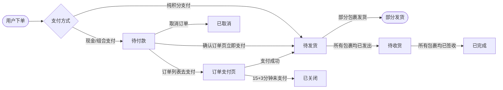
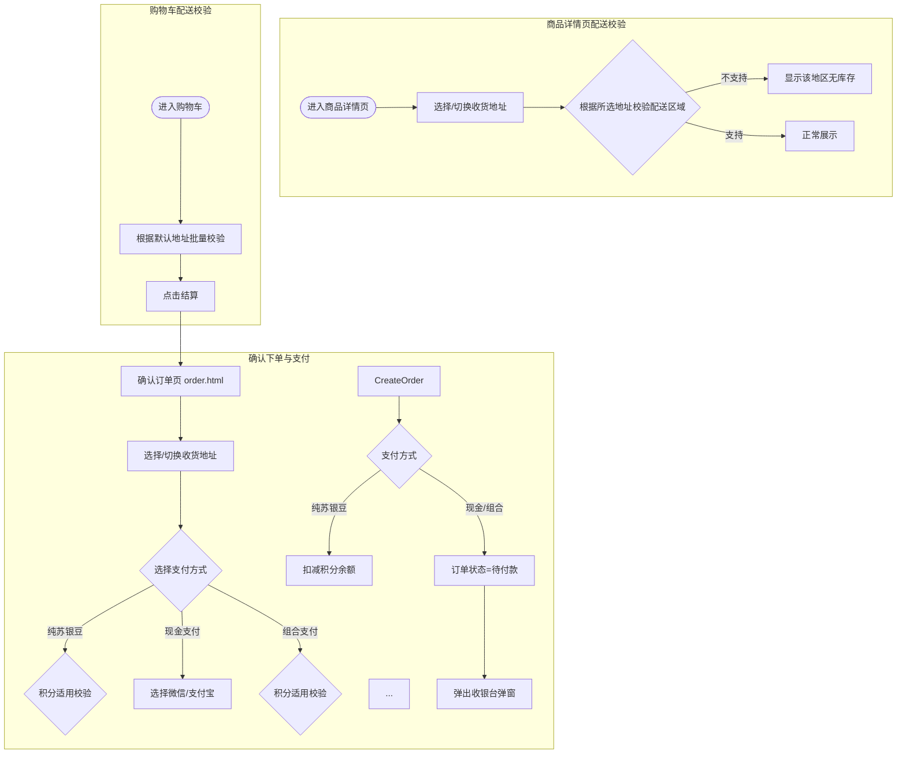

# 业务逻辑清单输入示例 V3.0

展示 logic-list-spec Extract 模式输出的正式版业务逻辑清单作为 prd-auto-generator 的输入示例。

---

## 输入格式

### 文件名格式

```
业务逻辑清单_V{版本}.md
```

### 核心结构

```markdown
# {项目名} - 业务逻辑清单 V{版本}（{模块概述}）

> 本文档为 V{版本} 版本增量业务逻辑清单，覆盖{模块概述}共 {N} 个页面。
> 
> 测试前先在浏览器控制台执行 `Auth.resetAccounts()` 重置账号数据。
> 
> **商品数据来源：** {数据来源说明}

---

## 一、{模块名} `V{版本}`

### 1.1 {页面名}（{filename}.html）


#### 1.1.1 功能用例表

| # | 场景 | 操作 | 预期结果 |
|---|------|------|----------|
| 1 | {场景} | {操作} | {预期结果} |

#### 1.1.2 关键字段数据来源

| 字段 | 数据来源 |
|------|----------|
| {字段名} | {数据来源描述} |

#### 1.1.3 业务逻辑增强

| # | 问题 | 认结果 |
|---|------|----------|
| 1 | {问题} | {确认结果} |

---

## {N}、页面导航 `V{版本}`

### {N}.1 跳转关系

| # | 页面A | 触发条件 | 页面B |
|---|-------|----------|-------|

### {N}.2 返回导航

### {N}.3 登录拦截

---

## {N+1}、状态流转 `V{版本}`

| 当前状态 | 可执行操作 | 目标状态 | 入口页面 |
|----------|-----------|----------|----------|
```

---

## 完整示例摘要：下单流程 V0.3

以下为 `苏银豆商城 - 业务逻辑清单 V0.3（下单流程）` 的结构摘要：

### 文档头部

```markdown
# 苏银豆商城 - 业务逻辑清单 V0.3（下单流程）

> 本文档为 V0.3 版本增量业务逻辑清单，覆盖商品详情、购物车、下单支付、订单管理共 8 个页面。
> 
> 测试前先在浏览器控制台执行 `Auth.resetAccounts()` 重置账号数据。
> 
> **商品数据来源：** 全量商品数据来源于品牌商城后台商品管理列表；组件/活动模块商品数据来源于魔方配置。
> 
> **统计口径：** 销量=SKU维度已完成订单商品件数；好评率=SKU五星好评数÷全部评价数×100%；折扣=现价÷原价×10。
```

### 状态流转章节

```markdown
## 一、订单流转 `V0.3`

### 1.1 订单状态流转



| 当前状态 | 可执行操作 | 入口页面 | 目标状态 |
|----------|-----------|----------|----------|
| — | 用户下单（纯积分支付） | 确认订单（order.html） | 待发货 |
| — | 用户下单（现金/组合支付） | 确认订单（order.html） | 待付款 |
| 待付款 | 取消订单 | 订单列表 | 已取消 |
| 待付款 | 立即支付（含现金） | 确认订单 → 收银台弹窗 | 待发货 |
| 待付款 | 超时未支付（15分钟+3分钟缓冲期） | 系统自动 | 已关闭 |
| 待发货 | 无（等待商家发货） | — | 待收货 |
| 待收货 | 确认收货 | 订单详情 | 已完成 |
```

### 下单与支付流程图

```markdown
### 1.2 下单与支付流程


```

### 页面章节示例

```markdown
## 二、商品详情 `V0.3`

### 2.1 商品详情页（product_detail.html）


#### 2.1.1 功能用例表

| # | 场景 | 操作 | 预期结果 |
|---|------|------|----------|
| 1 | 进入页面 | 扫码/搜索进入商品详情页 | 显示商品轮播图（5张）、商品标题、价格、销量、好评率、折扣标签 |
| 2 | 查看商品图片 | 点击轮播图图片 | 图片放大预览，支持左右滑动浏览5张图片 |
| 3 | 选择规格 | 点击"选择规格"按钮 | 弹出规格选择弹窗，显示可选SKU、价格、库存 |
| 4 | 加入购物车 | 选择规格后点击"加入购物车" | 校验配送区域，支持则加入购物车，底部Tab栏购物车图标显示红点数字 |
| 5 | 立即购买 | 选择规格后点击"立即购买" | 校验配送区域，支持则跳转确认订单页（order.html），携带SKU信息 |
| 6 | 配送不支持 | 所选地址不支持配送 | "加入购物车"和"立即购买"按钮置灰，提示"该地区无库存" |

#### 2.1.2 关键字段数据来源

| 字段 | 数据来源 |
|------|----------|
| 商品标题 | 品牌商城后台商品管理 — 商品名称字段 |
| 商品价格 | 品牌商城后台商品管理 — SKU价格字段 |
| 商品销量 | 品牌商城后台订单管理 — SKU维度已完成订单商品件数 |
| 好评率 | 品牌商城后台评价管理 — SKU五星好评数÷全部评价数×100% |
| 库存状态 | 品牌商城后台商品管理 — SKU库存字段 |
| 配送区域 | 品牌商城后台配送配置 — 地址匹配规则 |

#### 2.1.3 业务逻辑增强

| # | 问题 | 确认结果 |
|---|------|----------|
| 1 | 配送区域校验时机？ | 进入页面时根据默认地址校验，切换地址实时校验 |
| 2 | 商品图片数量限制？ | 最多5张，不足5张时轮播图显示实际数量 |
```

### 页面导航章节

```markdown
## 九、页面导航 `V0.3`

### 9.1 跳转关系

| # | 页面A | 触发条件 | 页面B |
|---|-------|----------|-------|
| 1 | 商品详情页（product_detail.html） | 点击"立即购买" | 确认订单页（order.html） |
| 2 | 商品详情页 | 点击"加入购物车"成功 | Toast提示成功，留在当前页 |
| 3 | 购物车页（cart.html） | 点击"结算" | 确认订单页（order.html） |
| 4 | 确认订单页 | 点击"立即支付"成功 | 支付成功页（pay_success.html） |
| 5 | 订单列表页（order_list.html） | 点击"去支付" | 订单支付页（order_pay.html） |
| 6 | 订单支付页 | 支付成功 | 支付成功页（pay_success.html） |
| 7 | 订单列表页 | 点击订单卡片 | 订单详情页（order_detail.html） |
| 8 | 订单详情页 | 点击"查看物流" | 物流追踪页（logistics.html） |

### 9.2 返回导航

- 商品详情页 → 返回上一页（history.back）
- 购物车页 → 返回上一页
- 确认订单页 → 返回购物车或商品详情（根据入口）
- 支付成功页 → 点击"返回首页"跳转首页
- 订单支付页 → 返回订单列表

### 9.3 登录拦截

| 类型 | 页面 |
|------|------|
| 受保护 | 购物车、确认订单、订单列表、订单详情、订单支付、支付成功、物流追踪 |
| 公开 | 商品详情（未登录可浏览，登录后可操作） |
```

---

## 关键映射内容

| 业务逻辑清单内容 | PRD章节 | 映射说明 |
|------------------|---------|----------|
| HMW问题陈述 | 需求背景 | 问题重述为需求背景描述 |
| 成功标准 | 需求分析 | 转化为验收指标、成功度量 |
| 页面定位 | 功能概述 | 功能描述 + 业务描述 + 触发条件 |
| 功能用例表 | 交互设计/流程图 | 操作→交互说明，多步骤→流程图 |
| 关键字段数据来源 | 数据设计 | 用户输入→输入项，系统生成→输出项，API→数据流转 |
| 业务逻辑增强 | 业务规则 | 问题→规则编号，建议答案→规则描述 |
| 状态流转表 | 状态机设计 | 状态→状态编码，流转→状态流转规则 |
| 跳转关系表 | 系统流程图 | 跳转关系→页面跳转流程图 |
| 登录拦截表 | 数据权限设计 | 受保护页面→权限标识定义 |

---

## 输入使用方式

### 方式1: 指定文件路径

```
用户提供业务逻辑清单路径：doc/V0.3/业务逻辑清单_V0.3.md
用户提供原型HTML目录：pages/
prd-auto-generator 自动读取并解析
```

### 方式2: 口述引用

```
用户口述："基于下单流程V0.3的业务逻辑清单生成PRD"
prd-auto-generator 查找对应版本的业务逻辑清单文件
```

### 方式3: 结合原型HTML

```
用户提供业务逻辑清单 + 原型HTML目录
prd-auto-generator 解析清单 + 分析原型HTML → 生成完整PRD
```

---

## 解析要点

prd-auto-generator 解析业务逻辑清单时会：

1. **提取模块层级** → PRD模块章节
2. **提取页面列表** → PRD页面章节
3. **解析功能用例表** → 映射到交互说明/流程图
4. **解析字段表** → 映射到输入项/输出项/数据流转
5. **解析业务规则** → 映射到业务规则表
6. **解析状态流转** → 映射到状态机设计
7. **解析跳转关系** → 映射到系统流程图
8. **解析登录拦截** → 映射到数据权限设计

---

## 完整文档参考

完整版业务逻辑清单示例可参考项目文档：
- `mini-program/doc/V0.3/业务逻辑清单_V0.3.md`

该文档包含：
- 8个页面完整用例表（商品详情、购物车、确认订单、支付成功、订单列表、订单支付、订单详情、物流追踪）
- 详细下单支付流程图（mermaid）
- 订单状态流转图（mermaid）
- 每页截图引用、功能用例表、关键字段数据来源、业务逻辑增强
- 页面导航：跳转关系、返回导航、登录拦截