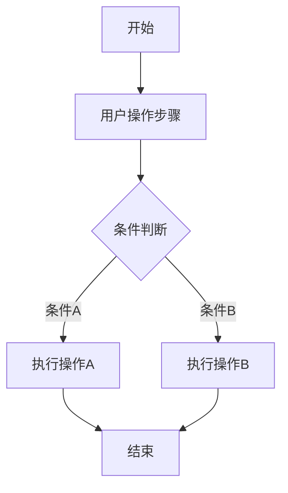
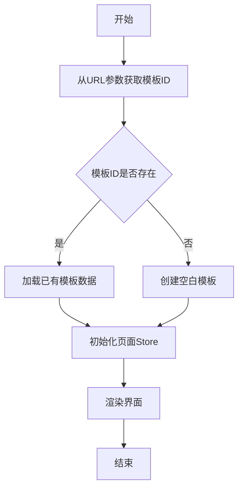

# PRD文档结构规范模板

> 本文档定义PRD文档的标准章节结构和编写规范，确保文档格式统一、层级清晰。

---

# 1. 需求背景【仅标题，后续补充】

# 2. 需求分析【仅标题，后续补充】

## 2.1. 历史需求

## 2.2. 招标要求

## 2.3. 竞品分析

### 2.3.1. {竞品名称}

### 2.3.2. {竞品名称}

# 3. 系统流程图【仅标题，后续补充】

## 3.1. 总体功能蓝图流程图

## 3.2. 总体功能现状流程图

# 4. 详细需求【仅标题，标题下无内容】

---

## PRD层级结构规范

### 层级定义

| 层级 | 格式 | 名称 | 说明 |
|------|------|------|------|
| 一级 | `# 1.` | 章节 | 需求背景、需求分析、系统流程图、详细需求等 |
| 二级 | `## 4.1.` | 系统 | 如：商城运营后台系统、供应商后台系统 |
| 三级 | `### 4.1.1.` | 模块 | 如：可视化编辑器模块、商品模块 |
| 四级 | `#### 4.1.1.1.` | 页面/面板 | 如：编辑器主界面、商品列表配置面板 |
| 五级 | `##### 1.` | 功能子项 | 功能概述、界面设计、业务逻辑等 |
| 六级 | `###### 2.1` | 细节项 | 页面原型、输出项说明等 |

### 页面章节结构

每个页面/面板章节包含以下六个子项：

```
#### 4.1.1.1. {页面名称}

##### 1. 功能概述【必须】
- 功能描述、业务描述、使用角色、触发条件

##### 2. 界面设计
    ###### 2.1 页面原型【必须，可留白后续补充】
    ###### 2.2 输出项说明

##### 3. 业务逻辑
    ###### 3.1 流程图
    ###### 3.2 业务规则
    ###### 3.3 状态机设计

##### 4. 交互设计
    ###### 4.1 输入项说明
    ###### 4.2 交互说明
    ###### 4.3 错误提示文案

##### 5. 数据设计
    ###### 5.1 数据流转说明
    ###### 5.2 数据权限设计

##### 6. 扩展功能
    ###### 6.1 批量操作规则
    ###### 6.2 操作日志要求
```

---

## 各子项编写规范

### 1. 功能概述

**必须包含**：
- 功能描述：该功能是什么
- 业务描述：解决什么业务问题
- 使用角色：谁会使用此功能
- 触发条件：从哪里进入，如何触发

**示例**：
```
##### 1. 功能概述

- **功能描述**：商品列表配置面板用于配置商品列表组件的显示样式、数据来源和商品属性。
- **业务描述**：商品列表是商城核心组件，用于展示商品信息，支持6种列表样式。
- **使用角色**：运营人员、模板设计师。
- **触发条件**：在画布中选中商品列表组件。
```

---

### 2. 界面设计

#### 2.1 页面原型

- **必须保留此标题**
- 内容可留白，后续补充原型图链接
- 格式：`（待补充）` 或原型图链接

#### 2.2 输出项说明

**表格格式**：

| 字段名称 | 字段标识 | 数据类型 | 数据来源 | 格式说明 |
|----------|----------|----------|----------|----------|
| 页面名称 | page_name | string | 用户输入 | 文本，最多30字符 |

**字段标识命名规范**：
- 统一使用下划线命名法（snake_case）
- 全部小写，单词之间用下划线连接
- 示例：`category_name`、`parent_id`、`created_at`

---

### 3. 业务逻辑

#### 3.1 流程图

**使用Mermaid语法**：



**流程图绘制场景判定**：

| 场景类型 | 是否必须 | 流程图类型 |
|----------|----------|------------|
| 用户操作流程（上传/删除/移动） | ✅ 必须 | flowchart TD |
| 多状态流转（审核/订单状态） | ✅ 必须 | stateDiagram-v2 |
| 数据跨模块流转 | ✅ 必须 | flowchart LR |
| 简单CRUD操作 | ⚪ 可选 | flowchart TD |
| 无状态的单步操作 | ❌ 不需要 | - |

**节点命名规范**：

| 节点类型 | 格式规范 | 示例 |
|----------|----------|------|
| 起始节点 | `[开始]` | `[开始]` |
| 结束节点 | `[结束]` | `[结束]` |
| 操作节点 | `[执行XX操作]` | `[打开上传弹窗]` |
| 判断节点 | `{是否XX条件}` | `{文件格式校验}` |

#### 3.2 业务规则

**表格格式**：

| 规则编号 | 规则名称 | 适用场景 | 规则描述 | 错误提示 |
|----------|----------|----------|----------|----------|
| RULE-001 | 页面类型唯一性 | 新建主页面 | 每种页面类型的主页面仅允许创建一个 | 该类型主页面已存在 |

**规则编号命名规范**：
- 格式：`RULE-{模块缩写}-{序号}` 或 `RULE-{序号}`
- 示例：`RULE-PAGE-001`、`RULE-001`

#### 3.3 状态机设计

**适用场景**：有状态流转的功能必须编写

**状态定义表**：

| 状态值 | 状态名称 | 状态说明 | 可见角色 |
|--------|----------|----------|----------|
| 0 | 草稿 | 新建未提交 | 供应商 |
| 1 | 待审核 | 已提交待审 | 供应商、运营 |

**状态流转规则表**：

| 当前状态 | 触发操作 | 目标状态 | 操作角色 | 前置条件 |
|----------|----------|----------|----------|----------|
| 草稿 | 提交审核 | 待审核 | 供应商 | 必填项完整 |

**状态对应UI差异表**：

| 状态 | 编辑 | 删除 | 上架 | 下架 |
|------|------|------|------|------|
| 草稿 | ✅ | ✅ | ❌ | ❌ |
| 待审核 | ❌ | ❌ | ❌ | ❌ |

---

### 4. 交互设计

#### 4.1 输入项说明

**表格格式（12列）**：

| 字段名称 | 字段标识 | 字段类型 | 必填 | 数据类型 | 长度限制 | 校验规则 | 取值范围 | 来源 | 提示文案 | 备注 |
|----------|----------|----------|------|----------|----------|----------|----------|------|----------|------|
| 页面名称 | page_name | 文本输入 | 是 | String | 1-30 | 非空校验 | - | 用户输入 | 请输入页面名称 | - |

**字段类型枚举**：

| 字段类型 | 说明 |
|----------|------|
| 文本输入 | 单行文本输入框 |
| 文本域 | 多行文本输入 |
| 下拉选择 | 下拉选择器 |
| 颜色选择器 | 颜色选择组件 |
| 数字输入 | 数字输入框 |
| 开关 | 开关组件 |
| 单选 | 单选按钮组 |
| 多选 | 复选框组 |
| 日期选择 | 日期选择器 |
| 文件上传 | 文件上传组件 |
| 富文本编辑器 | 富文本编辑 |

#### 4.2 交互说明

- 分步骤描述用户操作流程
- 使用数字编号（1. 2. 3.）
- 说明异常情况的处理方式

#### 4.3 错误提示文案

**分两个表格**：

**表单校验提示**：

| 校验字段 | 校验场景 | 提示文案 |
|----------|----------|----------|
| 页面名称 | 为空 | 请输入页面名称 |
| 页面名称 | 长度超限 | 页面名称不能超过30个字符 |

**业务异常提示**：

| 异常场景 | 错误码 | 提示文案 |
|----------|--------|----------|
| 分类已禁用 | 10001 | 该分类已禁用，请选择其他分类 |
| 无操作权限 | 10003 | 您没有权限操作此功能 |

---

### 5. 数据设计

#### 5.1 数据流转说明

**数据来源表**：

| 字段/数据 | 来源 | 获取方式 | 说明 |
|-----------|------|----------|------|
| 商品分类 | 分类管理模块 | 下拉选择 | 完整分类树 |

**数据去向表**：

| 数据 | 目标系统/模块 | 同步时机 | 说明 |
|------|---------------|----------|------|
| 商品信息 | 搜索服务 | 上架时 | 同步到ES |

#### 5.2 数据权限设计

**角色数据范围表**：

| 角色 | 数据范围 | 说明 |
|------|----------|------|
| 平台运营 | 全部数据 | 所有租户数据 |
| 供应商 | 本租户数据 | 本供应商数据 |

**功能权限点表**：

| 权限标识 | 权限名称 |
|----------|----------|
| page:add | 新增页面 |
| page:edit | 编辑页面 |
| page:delete | 删除页面 |

---

### 6. 扩展功能

#### 6.1 批量操作规则

| 操作名称 | 单次上限 | 前置条件 | 成功提示 |
|----------|----------|----------|----------|
| 批量删除 | 50条 | 草稿状态 | 成功删除{count}条 |

#### 6.2 操作日志要求

| 操作类型 | 记录内容 | 保留时长 |
|----------|----------|----------|
| 创建 | 操作人、时间、基本信息 | 3年 |
| 编辑 | 操作人、时间、变更内容 | 3年 |

---

## PRD完整示例

```
# 1. 需求背景

---

# 2. 需求分析

---

# 3. 系统流程图

---

# 4. 详细需求

## 4.1. 商城运营后台系统

### 4.1.1. 可视化编辑器模块

#### 4.1.1.1. 编辑器主界面

##### 1. 功能概述

- **功能描述**：可视化编辑器主界面采用四栏布局，提供所见即所得的页面编辑能力。
- **业务描述**：用于支撑运营人员快速创建和编辑商城模板。
- **使用角色**：运营人员、模板设计师。
- **触发条件**：从运营工作台点击「编辑」按钮进入编辑器。

##### 2. 界面设计

###### 2.1 页面原型

（待补充）

###### 2.2 输出项说明

| 字段名称 | 字段标识 | 数据类型 | 数据来源 | 格式说明 |
|----------|----------|----------|----------|----------|
| 模板名称 | template_name | string | 用户输入 | 文本，最多50字符 |

##### 3. 业务逻辑

###### 3.1 流程图



###### 3.2 业务规则

| 规则编号 | 规则名称 | 适用场景 | 规则描述 | 错误提示 |
|----------|----------|----------|----------|----------|
| RULE-001 | 四栏布局比例 | 界面渲染 | 左侧320px，画布弹性，操作区180px，属性面板340px | - |

##### 4. 交互设计

###### 4.1 输入项说明

| 字段名称 | 字段标识 | 字段类型 | 必填 | 数据类型 | 长度限制 | 校验规则 | 取值范围 | 来源 | 提示文案 | 备注 |
|----------|----------|----------|------|----------|----------|----------|----------|------|----------|------|
| 面板Tab选择 | panel_tab | Tab点击 | 否 | string | - | - | pages/components | 用户点击 | - | 默认页面面板 |

###### 4.2 交互说明

1. 点击「页面」或「组件」Tab切换面板内容。
2. 点击返回按钮，关闭编辑器窗口或跳转回运营工作台。

###### 4.3 错误提示文案

**表单校验提示**

| 校验字段 | 校验场景 | 提示文案 |
|----------|----------|----------|
| - | - | - |

**业务异常提示**

| 异常场景 | 错误码 | 提示文案 |
|----------|--------|----------|
| - | - | - |

##### 5. 数据设计

###### 5.1 数据流转说明

**数据来源**

| 字段/数据 | 来源 | 获取方式 | 说明 |
|-----------|------|----------|------|
| 模板数据 | 运营工作台 | URL参数传递模板ID | 包含所有页面和组件配置 |

###### 5.2 数据权限设计

**角色数据范围**

| 角色 | 数据范围 | 说明 |
|------|----------|------|
| 运营人员 | 所有模板 | 创建、编辑、删除、发布模板 |

**功能权限点**

| 权限标识 | 权限名称 |
|----------|----------|
| template:edit | 编辑模板 |

##### 6. 扩展功能

###### 6.1 批量操作规则

| 操作名称 | 单次上限 | 前置条件 | 成功提示 |
|----------|----------|----------|----------|
| - | - | - | - |

###### 6.2 操作日志要求

| 操作类型 | 记录内容 | 保留时长 |
|----------|----------|----------|
| - | - | - |

---

# 5. 非功能需求

## 5.1. 性能需求

| 指标名称 | 指标要求 |
|----------|----------|
| 页面加载时间 | 首屏加载 ≤ 3秒 |
| 操作响应时间 | 普通操作 ≤ 500ms |

## 5.2. 兼容性需求

| 类型 | 要求 |
|------|------|
| 浏览器 | Chrome 80+、Firefox 75+、Safari 13+、Edge 80+ |
| 分辨率 | 最低支持1366×768，推荐1920×1080 |

## 5.3. 安全需求

| 安全项 | 要求 |
|--------|------|
| 数据存储 | 模板数据存储在浏览器localStorage |
| XSS防护 | 富文本组件内容需进行XSS过滤 |

---

# 6. 附录

## 6.1. 术语表

| 术语 | 说明 |
|------|------|
| 楼层 | 页面中的组件单元 |

## 6.2. 相关文档

| 文档名称 | 文档路径 |
|----------|----------|
| 功能大纲 | docs/功能大纲.md |

---

# 7. 版本记录

| 版本号 | 修改日期 | 修改人 | 修改内容 |
|--------|----------|--------|----------|
| V1.0 | {日期} | {修改人} | 初稿创建 |