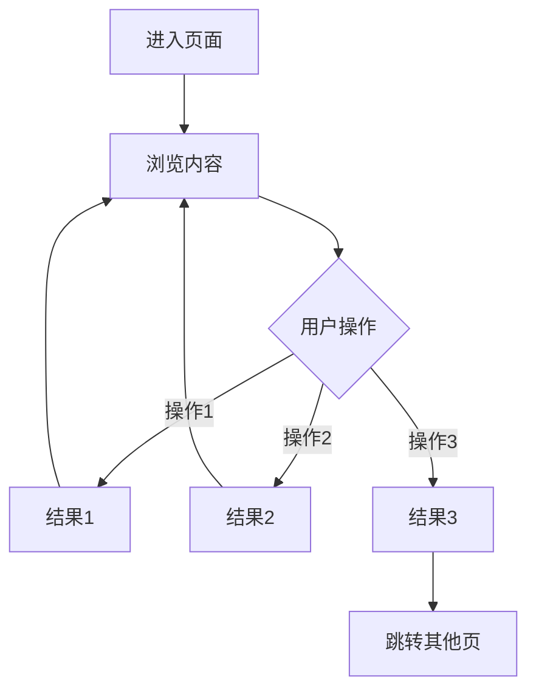
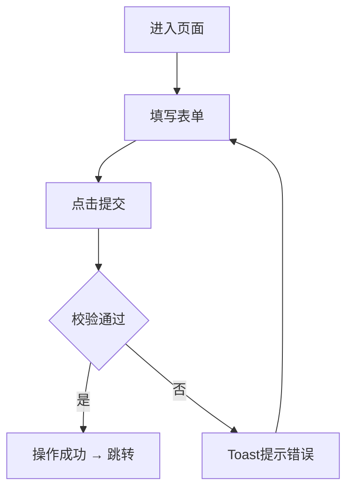
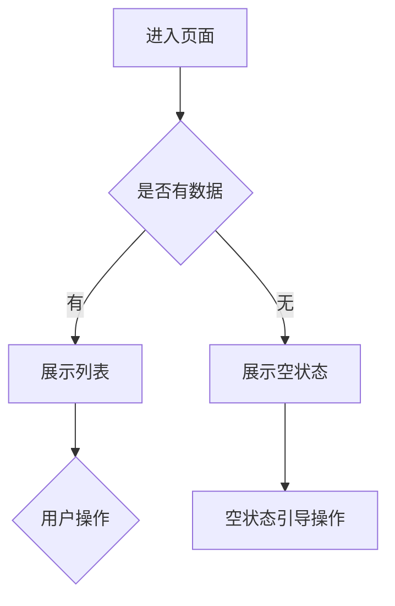

# 流程图规则 V5.0

## 基本原则

1. **有流程才画图** — 页面有明确的用户操作路径时必须画流程图；纯展示页（如静态图文页）可省略
2. **按需补充** — 以下场景必须补充流程图：
   - 有分支判断的操作（如登录校验、绑定冲突检测）
   - 多步骤流程（如注册流程、手机号修改步骤）
   - 有状态切换的交互（如浏览/编辑模式切换）
   - 复杂业务逻辑的文字描述难以直观理解时
3. **一个页面一张图** — 每个页面章节最多一张主流程图，不要拆成多张
4. **节点用中文** — 所有节点标签使用中文，与技术术语保持一致

---

## Mermaid 语法规范

### 使用 flowchart，不用 graph

```
✅ flowchart TD
❌ graph TD
```

### 方向选择

| 方向 | 适用场景 |
|------|----------|
| TD（从上到下） | 默认方向，适用于绝大多数页面流程 |
| LR（从左到右） | 仅用于线性步骤流程（如注册步骤条） |

### 节点类型

| 节点形状 | Mermaid语法 | 含义 | 示例 |
|----------|------------|------|------|
| 矩形 `[]` | `A[进入登录页]` | 起止节点 / 操作节点 | "进入购物车页"、"展示地址列表" |
| 菱形 `{}` | `B{用户选择}` | 判断/分支节点 | "校验通过？"、"购物车是否有商品？" |
| 圆角 `()` | `F(跳转首页)` | 最终结果/跳转节点 | "跳转首页"、"Toast提示错误" |

### 连线标签

- 分支连线必须标注条件，使用 `-->|条件|` 语法
- 标签用简短中文，不超过10个字

```
E -->|是| F[登录成功 → 跳转首页]
E -->|否| G[Toast提示错误]
```

---

## 节点命名规范

### 起始节点

固定格式：`A[进入{页面名称}]`

```
A[进入购物车页]
A[进入确认订单页]
```

### 判断节点

使用 `{}` 菱形，问句结尾：

```
B{购物车是否有商品}
E{校验通过}
C{用户操作}
```

其中"用户操作"类判断节点用于列举页面的多个并行操作入口：

```
C -->|点击搜索框| D[跳转搜索页]
C -->|滑动Banner| E[轮播切换]
C -->|点击商品| F[跳转商品详情]
```

### 操作节点

- 用方括号 `[]`，描述具体动作
- 多个连续动作用 `→` 连接，不用多个节点

```
✅ C[输入手机号 → 获取验证码]
❌ C[输入手机号] --> D[获取验证码]
```

### 跳转/结果节点

- 跳转到其他页面用 `→` 格式：`F[登录成功 → 跳转首页]`
- Toast提示：`G[Toast"已加入购物车"]`
- 留在当前页：`J[留在登录页]`

### 回环节节

操作完成后回到浏览状态，用一个通用节点收束：

```
D --> B   %% 回到浏览状态
G --> C   %% 回到用户选择
```

---

## 流程结构模式

### 模式一：浏览-操作循环

适用于信息展示+多入口的页面（首页、商品详情、购物车等）。



### 模式二：表单提交流程

适用于有明确填写→校验→提交路径的页面（登录、注册、新增地址等）。



### 模式三：条件分支流程

适用于有空状态/有状态区分的页面（购物车、订单列表等）。



---

## 文字补充规则

流程图后用1-3句话补充以下信息（不要逐节点复述流程图）：

1. **阈值/数值** — 如"滑动距离超过40px触发切换"
2. **时序细节** — 如"验证码按钮60秒倒计时"
3. **互斥逻辑** — 如"同一时刻只允许一个商品处于展开状态"
4. **动画效果** — 如"删除动画0.2s高度收缩+透明度淡出"

不需要补充的内容（流程图已表达清楚）：
- 节点之间的先后顺序
- 简单的点击跳转关系
- 判断的yes/no分支

---

## 禁止使用的字符

Mermaid 解析器会将以下字符视为语法标记，**在节点标签和连线标签中禁止使用**：

| 禁止字符 | 原因 | 替代方案 |
|----------|------|----------|
| `""` 中文引号 | 被解析为字符串分隔符，导致 Parse error | 去掉引号，用空格分隔；或使用「」 |
| `""` 英文引号 | 同上 | 同上 |
| `()` | 用于圆角节点语法 | 节点文本中避免使用，或用 `（）` 全角括号 |
| `{}` | 用于菱形节点语法 | 节点文本中避免使用 |
| `[]` | 用于矩形节点语法 | 节点文本中避免使用 |
| `>` | 用于连线箭头语法 | 用文字"跳转"代替 |

### 典型错误示例

```
❌ I -->|拒绝/关闭遮罩| J[Toast"已拒绝授权" → 留在登录页]
```
报错：`Expecting 'SQE', got 'STR'`，因为 `""` 被解析器当作字符串分隔符。

```
✅ I -->|拒绝/关闭遮罩| J[Toast 已拒绝授权 → 留在登录页]
```

### 正确写法对照

| 场景 | 错误写法 | 正确写法 |
|------|----------|----------|
| Toast 提示文案 | `[Toast"已加入购物车"]` | `[Toast 已加入购物车]` |
| 点击按钮名称 | `-->|点击"立即购买"|` | `-->|点击 立即购买|` |
| Alert 提示文案 | `[Alert"请填写完整信息"]` | `[Alert 请填写完整信息]` |

**原则**：节点标签中用空格代替引号来分隔操作类型和具体文案。引号只出现在流程图外的正文描述中。

---

## 常见错误

| 错误做法 | 正确做法 |
|----------|----------|
| 节点标签使用引号 `""` | 去掉引号，用空格分隔 |
| 每个输入框画一个节点 | 合并为"填写表单"一个节点 |
| 跳转后再画目标页面的流程 | 跳转节点即为终点，不展开目标页面 |
| 判断节点不写条件标签 | 所有分支必须标注 `-->|条件|` |
| 用英文命名节点 | 全部使用中文 |
| 同一页面画多张流程图 | 合并为一张，用分支表达 |
| 流程图后逐句翻译流程图 | 只补充阈值、时序、动画等细节 |
