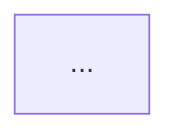
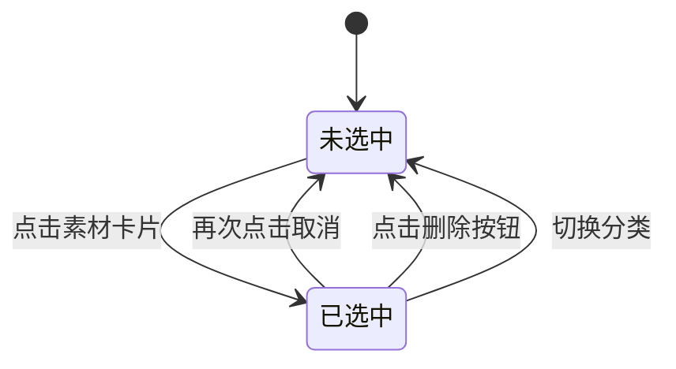

# 流程图编写细则

## 绘制场景判定

### 必须绘制流程图的场景

| 场景类型 | 是否必须 | 流程图类型 | 示例 |
|----------|----------|------------|------|
| 用户操作流程（上传/删除/移动） | ✅ 必须 | flowchart TD | 上传图片流程、删除素材流程 |
| 多状态流转（审核/订单状态） | ✅ 必须 | stateDiagram-v2 | 审核状态流转、订单状态变化 |
| 数据跨模块流转 | ✅ 必须 | flowchart LR | 素材选择数据流转 |
| 简单CRUD操作 | ⚪ 可选 | flowchart TD | 列表查询 |
| 无状态的单步操作 | ❌ 不需要 | - | 简单的点击跳转 |

### 判断依据

- 涉及多步骤操作 → 必须绘制
- 包含条件分支判断 → 必须绘制
- 存在状态变化 → 必须绘制
- 单一操作无分支 → 可省略

## 流程图类型选择指南

| 流程图类型 | 适用场景 | 方向说明 | 示例 |
|------------|----------|----------|------|
| `flowchart TD` | 用户操作流程、业务处理流程 | 自顶向下 | 上传流程、删除流程、移动流程 |
| `flowchart LR` | 数据流转、模块交互 | 从左到右 | 模块间数据同步、系统交互 |
| `stateDiagram-v2` | 状态机设计、状态流转 | 状态节点 | 素材选中状态、审核状态、订单状态 |
| `sequenceDiagram` | 时序交互（可选） | 时间线 | API调用时序、系统交互时序 |

## 节点命名规范

| 节点类型 | 格式规范 | 示例 |
|----------|----------|------|
| 起始节点 | `[开始]` | `[开始]` |
| 结束节点 | `[结束]` | `[结束]` |
| 操作节点 | `[执行XX操作]` 或 `[XX操作描述]` | `[打开上传弹窗]`、`[保存素材信息]` |
| 判断节点 | `{是否XX条件}` 或 `{XX校验}` | `{文件格式校验}`、`{用户确认}` |

## 连接线标注规范

- 条件分支必须标注：`|条件说明|`
- 通过条件：`|通过|` 或 `|是|`
- 不通过条件：`|不通过|` 或 `|否|`
- 异常情况：`|超过限制|`、`|格式错误|`

## 流程图命名规范

```markdown
**{操作名称}流程**


```

## 流程图与业务规则映射

### 映射原则

流程图中的判断分支必须与业务规则表格一一对应。

### 映射规范

| 流程图元素 | 对应业务规则 | 示例 |
|------------|--------------|------|
| 格式校验分支 | RULE-XXX-001 文件格式限制 | `{文件格式校验} -->|不通过| [提示格式错误]` |
| 大小校验分支 | RULE-XXX-002 文件大小限制 | `{文件大小校验} -->|超过限制| [提示文件过大]` |
| 层级校验分支 | RULE-XXX-003 分类层级限制 | `{层级校验} -->|超限| [提示已达最大层级]` |

### 映射检查要点

1. 流程图中每个判断节点都应有对应的业务规则
2. 业务规则表格中的错误提示应与流程图中的错误节点文案一致
3. 错误码（如 MAT-001）应与业务异常提示表格对应

## 标准示例

### 上传图片流程完整示例

```mermaid
flowchart TD
    A[开始] --> B[点击上传图片按钮]
    B --> C[打开上传弹窗]
    C --> D[选择目标分类]
    D --> E[选择或拖拽文件]
    E --> F{文件格式校验}
    F -->|不通过| G[提示"只能上传JPG、JPEG、PNG、GIF、WEBP格式的文件"]
    G --> E
    F -->|通过| H{文件大小校验}
    H -->|超过3MB| I[提示"文件大小不能超过3MB"]
    I --> E
    H -->|通过| J[添加到上传列表]
    J --> K[点击上传按钮]
    K --> L[生成素材ID]
    L --> M[创建本地预览URL]
    M --> N[保存素材信息]
    N --> O[刷新素材列表]
    O --> P[结束]
```

### 状态机设计示例



### 示例规范要点

1. 所有分支都有明确的条件标注
2. 异常分支形成闭环（回到操作步骤）
3. 错误提示文案与业务规则表格一致
4. 包含完整的开始和结束节点
5. 节点命名清晰、语义明确

## 流程图完整性检查

| 检查项 | 检查内容 | 是否必须 |
|--------|----------|----------|
| 开始结束节点 | 流程图包含明确的开始和结束节点 | ✅ 必须 |
| 条件标注完整 | 所有判断分支都有明确的条件标注 | ✅ 必须 |
| 异常处理闭环 | 错误/异常分支有处理路径（回到操作或结束） | ✅ 必须 |
| 业务规则对应 | 流程图分支与业务规则表格一一对应 | ✅ 必须 |
| 错误提示一致 | 流程图中的错误提示与业务规则表一致 | ✅ 必须 |
| 状态图完整 | 状态机图包含所有状态定义和流转规则 | ✅ 必须 |
| 节点命名规范 | 节点命名符合规范格式 | ⚪ 建议 |
| 流程方向合理 | 流程方向与业务逻辑一致 | ⚪ 建议 |