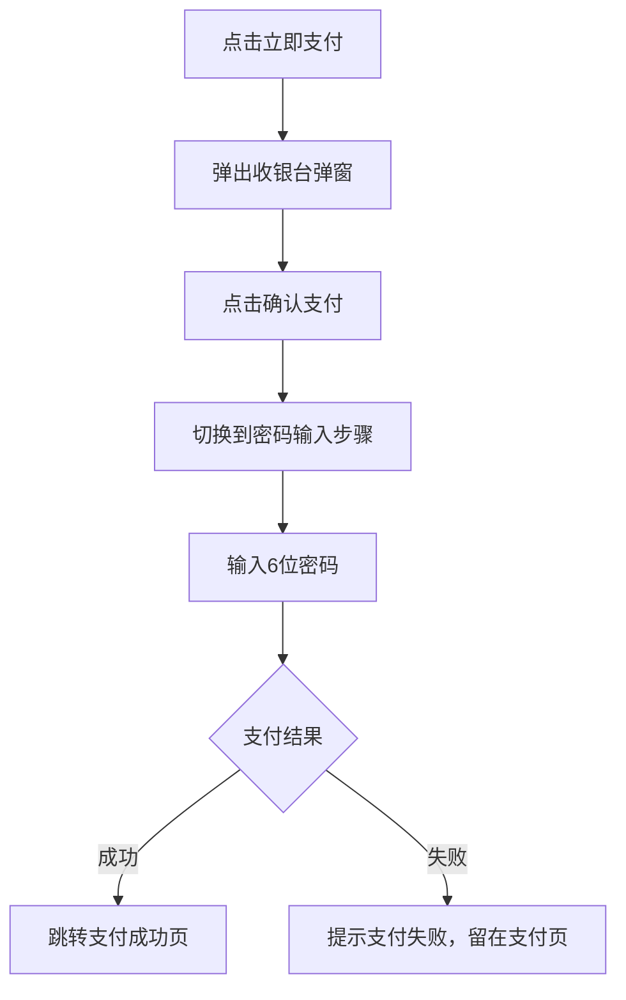
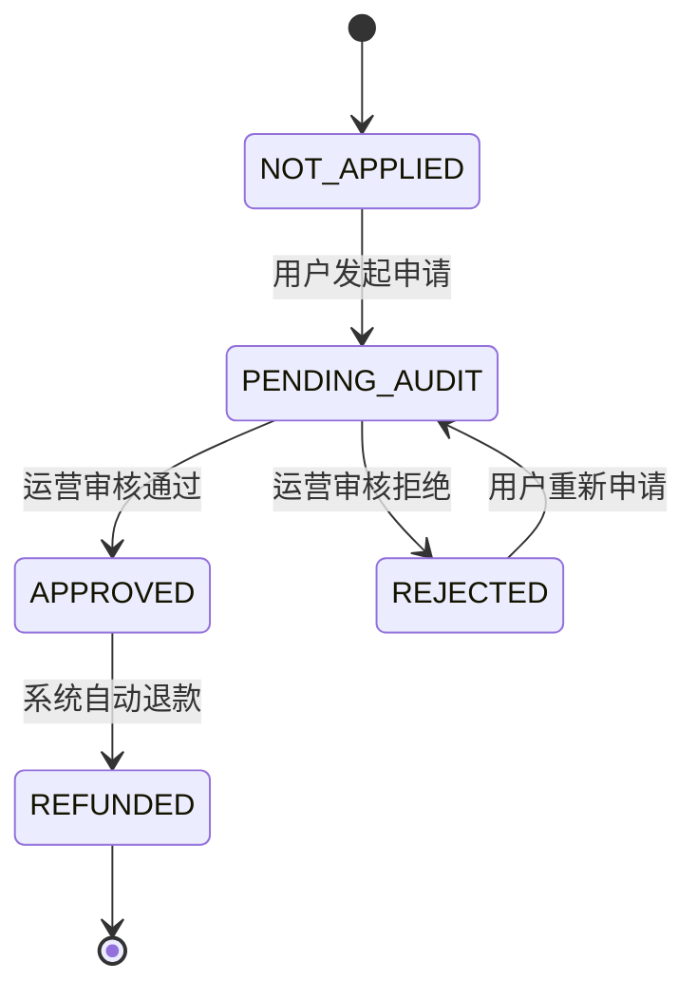
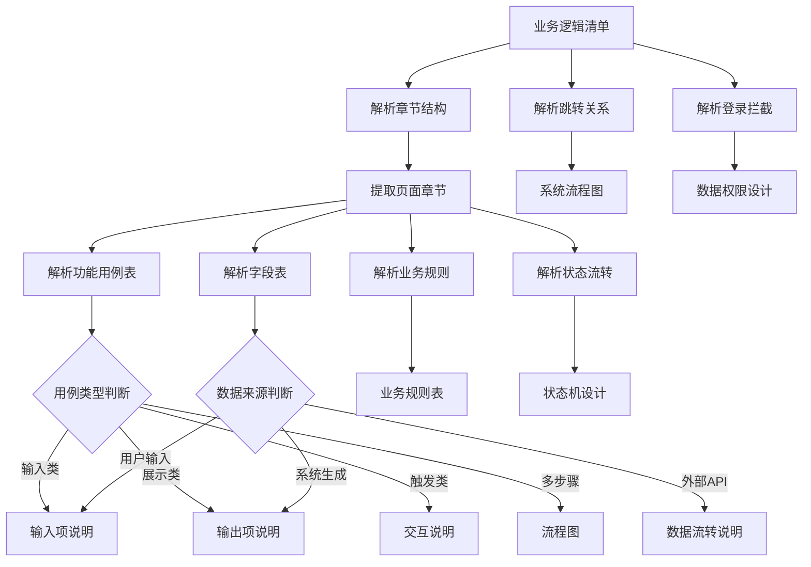

# 业务逻辑清单 → PRD映射规则 V3.0

定义 logic-list-spec 输出的业务逻辑清单如何映射到 PRD 文档章节。

---

## 映射原则

**一一映射**：业务逻辑清单的每个页面章节映射到 PRD 的一个页面章节。

---

## 输入来源

接收 logic-list-spec Extract 模式输出的正式版业务逻辑清单，文件名格式：
- `业务逻辑清单_V{版本}.md`

---

## 全局章节映射

| 业务逻辑清单内容 | PRD章节 | 映射说明 |
|------------------|---------|----------|
| HMW问题陈述 | `# 1. 需求背景` | 问题重述为需求背景描述 |
| 成功标准 | `# 2. 需求分析` | 转化为验收指标、成功度量 |
| 页面导航跳转关系 | `# 3. 系统流程图` | 跳转关系 → 页面跳转流程图 |

---

## 页面章节映射

| 业务逻辑清单章节 | PRD章节 | 映射说明 |
|------------------|---------|----------|
| H3页面标题 | `#### 4.1.1.{n}. {页面名称}` | 直接映射页面名称 |
| 页面定位（如有） | `##### 1. 功能概述` | 功能描述 + 业务描述 + 触发条件 |

---

## 功能用例表 → PRD章节映射

### 操作类型判断

| 操作关键词 | 用例类型 | PRD章节 |
|------------|----------|---------|
| 输入、填写、填写信息 | 输入类 | `###### 4.1 输入项说明` |
| 选择、下拉、Tab切换 | 选择类 | `###### 4.1 输入项说明` |
| 点击、点击按钮、点击提交 | 触发类 | `###### 4.2 交互说明` |
| 查看显示、显示、展示 | 展示类 | `###### 2.2 输出项说明` |
| 弹出弹窗、弹出确认 | 弹窗类 | `###### 4.2 交互说明` |
| 校验失败、提示 | 错误类 | `###### 4.3 错误提示文案` |

### 多步骤用例 → 流程图

当功能用例表包含连续多个步骤时，生成流程图：

**判断条件：**
- 同一场景有多个操作步骤
- 操作之间存在条件分支（`if/else`）

**映射方式：**
```
用例操作 → 流程图节点
用例预期结果 → 节点间连接线标注
条件判断 → 分支节点
```

### 流程图生成示例

**业务逻辑清单用例：**
```markdown
| # | 场景 | 操作 | 预期结果 |
|---|------|------|----------|
| 1 | 提交订单 | 点击"立即支付" | 弹出收银台弹窗 |
| 2 | 确认支付 | 点击"确认支付" | 弹窗切换到密码输入步骤 |
| 3 | 输入密码 | 输入6位密码 | 自动跳转支付成功页 |
| 4 | 支付失败 | 网络异常 | 提示"支付失败"，留在支付页 |
```

**映射流程图：**


---

## 关键字段数据来源 → PRD章节映射

### 数据来源类型判断

| 数据来源关键词 | 数据类型 | PRD章节 |
|----------------|----------|---------|
| 用户操作、用户输入、用户填写 | 用户输入 | `###### 4.1 输入项说明` |
| 用户选择、Tab选择、下拉选择 | 用户选择 | `###### 4.1 输入项说明` |
| 系统生成、自动记录、自动生成 | 系统生成 | `###### 2.2 输出项说明` |
| 品牌商城后台、后台、API查询 | 外部API | `###### 5.1 数据流转说明` |
| 上一页面传入、上一页传入 | 页面传参 | `###### 5.1 数据流转说明` |
| 前端实时计算、实时计算 | 前端计算 | `###### 2.2 输出项说明` |

### 字段映射示例

**业务逻辑清单字段：**
```markdown
| 字段 | 数据来源 |
|------|----------|
| 申请类型 | 用户操作 — Tab选择 |
| 申请原因 | 用户操作 — 下拉选择 |
| 凭证图片 | 用户操作 — 图片上传 |
| 申请状态 | 品牌商城后台售后管理 |
| 审核时间 | 系统生成 — 审核时自动记录 |
```

**映射输出项说明：**
```markdown
| 字段名称 | 字段标识 | 数据类型 | 数据来源 | 格式说明 |
|----------|----------|----------|----------|----------|
| 申请状态 | apply_status | string | 品牌商城后台售后管理API | 状态枚举值 |
| 审核时间 | audit_time | datetime | 系统自动生成 | yyyy-MM-dd HH:mm:ss |
```

**映射输入项说明：**
```markdown
| 字段名称 | 字段标识 | 字段类型 | 必填 | 数据类型 | 来源 | 提示文案 |
|----------|----------|----------|------|----------|------|----------|
| 申请类型 | apply_type | Tab选择 | 是 | string | 用户选择 | 请选择申请类型 |
| 申请原因 | apply_reason | 下拉选择 | 是 | string | 用户选择 | 请选择申请原因 |
| 凭证图片 | evidence_images | 图片上传 | 是 | image[] | 用户上传 | 请上传凭证图片 |
```

---

## 业务逻辑增强 → 业务规则映射

### 规则编号生成

格式：`RULE-{模块缩写}-{序号}`

示例：`RULE-AF-001`（售后模块规则1）

### 映射方式

| 业务逻辑增强类型 | PRD业务规则 |
|------------------|-------------|
| `[必验]` 问题 | 关键规则，标记为必须校验 |
| `[待确认]` 建议 | 规则描述使用建议答案，标记为待确认 |
| 数量限制 | 校验规则（如：最多3张） |
| 时效限制 | 校验规则（如：7天内） |

### 映射示例

**业务逻辑清单：**
```markdown
| # | 问题 | 确认结果 |
|---|------|----------|
| 1 | 申请时效限制？ | （建议：订单完成后7天内可申请） |
| 2 | 图片数量限制？ | （建议：最多3张，单张≤5MB） |
| 3 | 审核时效SLA？ | （建议：48小时内） |
```

**映射业务规则表：**
```markdown
| 规则编号 | 规则名称 | 适用场景 | 规则描述 | 错误提示 |
|----------|----------|----------|----------|----------|
| RULE-AF-001 | 申请时效限制 | 用户发起申请 | 仅订单完成后7天内可发起申请 | 该订单已超过售后申请时效 |
| RULE-AF-002 | 凭证图片数量 | 用户上传凭证 | 最多上传3张凭证图片 | 最多上传3张图片 |
| RULE-AF-003 | 凭证图片大小 | 用户上传凭证 | 单张图片不超过5MB | 图片大小不能超过5MB |
```

---

## 状态流转表 → 状态机设计映射

### 状态编码生成

从状态流转表提取所有状态，生成状态编码表。

### 映射方式

| 状态流转表内容 | PRD状态机设计 |
|----------------|---------------|
| 当前状态列 | 状态编码定义表 |
| 可执行操作列 | 状态触发事件 |
| 目标状态列 | 状态流转规则 |
| 执行者列 | 权限判断 |

### 映射示例

**业务逻辑清单状态流转：**
```markdown
| 当前状态 | 可执行操作 | 目标状态 | 执行者 |
|----------|-----------|----------|--------|
| 未申请 | 用户发起申请 | 待审核 | 用户 |
| 待审核 | 运营审核通过 | 已通过 | 运营 |
| 待审核 | 运营审核拒绝 | 已拒绝 | 运营 |
| 已拒绝 | 用户重新申请 | 待审核 | 用户 |
| 已通过 | 系统退款完成 | 已退款 | 系统 |
```

**映射状态定义表：**
```markdown
| 状态编码 | 状态名称 | 状态描述 |
|----------|----------|----------|
| NOT_APPLIED | 未申请 | 用户未发起售后申请 |
| PENDING_AUDIT | 待审核 | 申请提交，等待运营审核 |
| APPROVED | 已通过 | 审核通过，等待退款 |
| REJECTED | 已拒绝 | 审核拒绝，用户可重新申请 |
| REFUNDED | 已退款 | 退款完成，流程结束 |
```

**映射状态流转图：**


---

## 页面导航 → 系统流程图映射

### 跳转关系提取

从跳转关系表提取页面间跳转，生成系统流程图。

### 映射示例

**业务逻辑清单跳转关系：**
```markdown
| # | 页面A | 触发条件 | 页面B |
|---|-------|----------|-------|
| 1 | 订单详情 | 点击"申请售后" | 申请页 |
| 2 | 申请页 | 提交成功 | 进度页 |
| 3 | 进度页 | 点击申请卡片 | 详情页 |
```

**映射系统流程图：**


---

## 登录拦截 → 数据权限设计映射

### 映射方式

| 登录拦截表内容 | PRD数据权限设计 |
|----------------|-----------------|
| 受保护页面列表 | 权限标识定义 |
| 公开页面列表 | 无权限要求 |

### 映射示例

**业务逻辑清单登录拦截：**
```markdown
| 类型 | 页面 |
|------|------|
| 受保护 | 申请页、进度页、详情页 |
| 公开 | 无 |
```

**映射权限标识：**
```markdown
| 权限标识 | 权限名称 |
|----------|----------|
| aftersales:apply | 售后申请权限 |
| aftersales:progress | 售后进度查看权限 |
| aftersales:detail | 售后详情查看权限 |
```

---

## 映射流程总结



---

## 映射验证清单

- [ ] 所有页面章节映射到PRD页面章节
- [ ] 所有功能用例映射到对应章节（输入项/输出项/交互/流程图）
- [ ] 所有字段映射到对应章节（输入项/输出项/数据流转）
- [ ] 所有业务规则映射到业务规则表
- [ ] 状态流转映射到状态机设计
- [ ] 跳转关系映射到系统流程图
- [ ] 登录拦截映射到数据权限设计