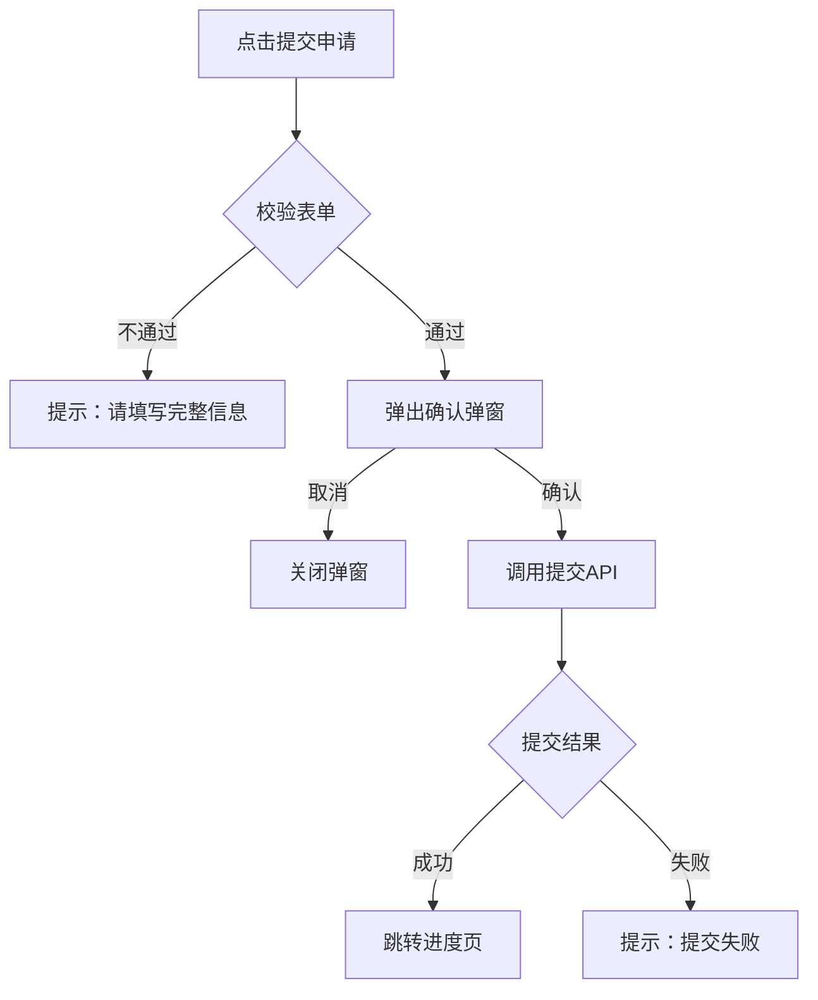
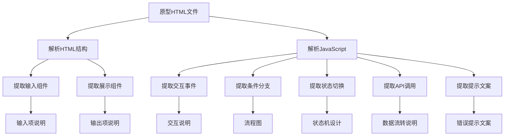

# 原型HTML分析方法 V3.0

定义如何从 prototype-design 输出的原型 HTML 文件中提取信息，补充 PRD 文档。

---

## 输入来源

接收 prototype-design 输出的原型 HTML 文件，目录结构：
- `pages/{page_name}.html`
- `js/common.js`
- `css/common.css`

---

## 分析层次

### 第一层：页面结构分析

| 分析维度 | 提取内容 | PRD用途 |
|----------|----------|---------|
| 页面标题 | `<title>` 标签文本 | 页面名称 |
| 导航标题 | `.nav-title` 文本 | 功能概述标题 |
| 页面区域 | 主要 CSS class 划分 | 页面原型结构描述 |

### 第二层：组件分析

| 分析维度 | 提取内容 | PRD用途 |
|----------|----------|---------|
| 输入组件 | `<input>`、`<textarea>`、`<select>` | 输入项说明 |
| 按钮组件 | `<button>`、`.btn-*` | 交互说明 |
| 展示组件 | 数据展示区域 | 输出项说明 |
| 弹窗组件 | `.popup`、`.modal` | 交互说明（弹窗交互） |

### 第三层：交互分析

| 分析维度 | 提取内容 | PRD用途 |
|----------|----------|---------|
| 点击事件 | `onclick`、`addEventListener('click')` | 交互说明 |
| 跳转链接 | `location.href`、`href="..."` | 系统流程图 |
| 条件分支 | `if/else` | 流程图分支 |
| 状态切换 | `classList.add/remove/toggle` | 状态机设计 |

### 第四层：提示文案分析

| 分析维度 | 提取内容 | PRD用途 |
|----------|----------|---------|
| Toast提示 | `toast('...')`、`.toast` | 错误提示文案 |
| Alert提示 | `alert('...')` | 错误提示文案 |
| 表单提示 | placeholder 属性 | 输入项提示文案 |

---

## 输入项提取规则

### HTML标签识别

| HTML标签 | 字段类型 | 提取属性 |
|----------|----------|----------|
| `<input type="text">` | 文本输入 | placeholder、maxlength、id |
| `<input type="number">` | 数字输入 | min、max、step |
| `<input type="tel">` | 电话输入 | placeholder、maxlength |
| `<input type="password">` | 密码输入 | maxlength |
| `<textarea>` | 多行文本 | placeholder、rows、maxlength |
| `<select>` | 下拉选择 | option列表、selected |
| `<input type="checkbox">` | 复选框 | checked |
| `<input type="radio">` | 单选组 | name、checked |

### 提取示例

**原型HTML：**
```html
<input type="text" id="apply_reason" placeholder="请选择申请原因" maxlength="50">
<textarea id="remark" placeholder="选填，对本次交易的说明" maxlength="200" rows="3">
<select id="apply_type">
  <option value="refund_only">仅退款</option>
  <option value="return_refund">退货退款</option>
</select>
```

**提取输入项：**
```markdown
| 字段名称 | 字段标识 | 字段类型 | 必填 | 长度限制 | 提示文案 |
|----------|----------|----------|------|----------|----------|
| 申请原因 | apply_reason | 文本输入 | 是 | 50 | 请选择申请原因 |
| 备注 | remark | 多行文本 | 否 | 200 | 选填，对本次交易的说明 |
| 申请类型 | apply_type | 下拉选择 | 是 | - | 仅退款/退货退款 |
```

---

## 输出项提取规则

### 展示区域识别

| CSS类名模式 | 展示类型 | 提取内容 |
|-------------|----------|----------|
| `.status-tag` | 状态标签 | 状态文本、颜色 |
| `.price-tag` | 价格展示 | 价格值 |
| `.product-card` | 商品卡片 | 商品信息字段 |
| `.order-info` | 订单信息 | 订单字段列表 |
| `.time-text` | 时间展示 | 时间格式 |

### 提取示例

**原型HTML：**
```html
<div class="status-tag pending">待审核</div>
<div class="price-tag">¥99.00</div>
<div class="order-info">
  <span class="order-id">订单号：202401010001</span>
  <span class="order-time">下单时间：2024-01-01 10:00</span>
</div>
```

**提取输出项：**
```markdown
| 字段名称 | 字段标识 | 数据类型 | 格式说明 |
|----------|----------|----------|----------|
| 申请状态 | apply_status | string | 状态枚举：待审核/已通过/已拒绝 |
| 实付金额 | actual_price | number | ¥XX.XX格式 |
| 订单号 | order_id | string | 订单编号 |
| 下单时间 | order_time | datetime | yyyy-MM-dd HH:mm格式 |
```

---

## 交互事件提取规则

### 点击事件提取

| 事件模式 | 提取内容 | PRD用途 |
|----------|----------|---------|
| `onclick="handleAction()"` | 交互操作 | 交互说明 |
| `addEventListener('click', ...)` | 交互操作 | 交互说明 |
| `onclick="location.href='page.html'"` | 页面跳转 | 系统流程图 |
| `onclick="history.back()"` | 返回操作 | 交互说明 |

### 提取示例

**原型HTML：**
```html
<button onclick="submitApply()">提交申请</button>
<button onclick="location.href='progress.html'">查看进度</button>
<a href="detail.html?apply_id=123">查看详情</a>
```

**提取交互说明：**
```markdown
1. **提交申请**
   - 点击"提交申请"按钮 → 调用submitApply() → 弹出确认弹窗
   
2. **查看进度**
   - 点击"查看进度"按钮 → 跳转进度页（progress.html）
   
3. **查看详情**
   - 点击"查看详情"链接 → 跳转详情页（detail.html），携带apply_id参数
```

---

## 流程图生成规则

### 条件分支识别

从原型HTML的 JavaScript 代码中提取条件分支：

| JS模式 | 流程图节点 | 连接线标注 |
|--------|------------|------------|
| `if (condition) { ... } else { ... }` | 分支节点 `{是否满足条件}` | `|满足|` / `|不满足|` |
| `switch (value) { case 'A': ... }` | 多分支节点 `{判断类型}` | `|类型A|` / `|类型B|` |
| `value ? actionA : actionB` | 分支节点 | `|true|` / `|false|` |

### 流程步骤串联

从函数调用链提取流程步骤：

| JS模式 | 流程图步骤 |
|--------|------------|
| `funcA() → funcB() → funcC()` | 步骤1 → 步骤2 → 步骤3 |
| 异步调用 `await api.call()` | 步骤 + 等待节点 |

### 生成示例

**原型JS：**
```javascript
function submitApply() {
  if (!validateForm()) {
    showToast('请填写完整信息');
    return;
  }
  showConfirmModal('确认提交申请？', function() {
    api.submitApply(formData).then(function(res) {
      if (res.success) {
        location.href = 'progress.html?apply_id=' + res.applyId;
      } else {
        showToast('提交失败：' + res.message);
      }
    });
  });
}
```

**生成流程图：**


---

## 状态机设计提取规则

### 状态字段识别

| 变量模式 | 状态类型 | 提取内容 |
|----------|----------|----------|
| `status = 'pending'` | 状态变量 | 状态值列表 |
| `state = { current: 'A', next: 'B' }` | 状态对象 | 状态流转关系 |
| `classList.add('status-active')` | CSS状态类 | 状态样式映射 |

### 状态流转提取

| JS模式 | 状态流转 |
|--------|----------|
| `status = 'approved'` | 当前状态 → 已通过 |
| `if (status === 'pending') { approve() }` | 待审核 → 触发审批操作 |
| 状态切换函数 `changeState(from, to)` | 状态流转规则 |

### 生成示例

**原型JS：**
```javascript
const STATUS = {
  PENDING: 'pending',
  APPROVED: 'approved',
  REJECTED: 'rejected',
  REFUNDED: 'refunded'
};

function approveApply(applyId) {
  if (currentStatus === STATUS.PENDING) {
    api.approve(applyId).then(() => {
      updateStatus(STATUS.APPROVED);
    });
  }
}
```

**生成状态定义：**
```markdown
| 状态编码 | 状态名称 | 状态描述 |
|----------|----------|----------|
| pending | 待审核 | 申请提交，等待审核 |
| approved | 已通过 | 审核通过，等待退款 |
| rejected | 已拒绝 | 审核拒绝，可重新申请 |
| refunded | 已退款 | 退款完成 |
```

---

## 错误提示提取规则

### Toast提示提取

| JS模式 | 提取内容 |
|--------|----------|
| `toast('请填写完整信息')` | 表单校验提示 |
| `toast('提交失败')` | 业务异常提示 |
| `showMessage('操作成功')` | 成功提示 |

### 提取示例

**原型JS：**
```javascript
if (!applyType) {
  toast('请选择申请类型');
}
if (evidenceImages.length === 0) {
  toast('请上传至少1张凭证图片');
}
if (res.code === 500) {
  toast('系统错误，请稍后重试');
}
```

**提取错误提示：**
```markdown
**表单校验提示**

| 校验字段 | 校验场景 | 提示文案 |
|----------|----------|----------|
| 申请类型 | 未选择 | 请选择申请类型 |
| 凭证图片 | 未上传 | 请上传至少1张凭证图片 |

**业务异常提示**

| 异常场景 | 错误码 | 提示文案 |
|----------|--------|----------|
| 系统异常 | 500 | 系统错误，请稍后重试 |
```

---

## 数据流转提取规则

### API调用识别

| JS模式 | 数据来源 |
|--------|----------|
| `api.getProduct(productId)` | 商品详情API |
| `api.getOrder(orderId)` | 订单详情API |
| `api.submitApply(formData)` | 提交申请API |
| `localStorage.getItem('user')` | 本地存储 |

### 提取示例

**原型JS：**
```javascript
// 获取订单信息
const orderInfo = await api.getOrder(orderId);

// 获取用户地址
const addressList = await api.getAddressList();

// 提交申请
const result = await api.submitApply({
  order_id: orderId,
  apply_type: applyType,
  reason: applyReason,
  evidence: evidenceImages
});
```

**提取数据流转：**
```markdown
| 字段/数据 | 来源 | 获取方式 | 说明 |
|-----------|------|----------|------|
| 订单信息 | 品牌商城后台订单API | api.getOrder(orderId) | 订单详情数据 |
| 地址列表 | 品牌商城后台地址API | api.getAddressList() | 用户收货地址 |
| 申请数据 | 用户输入 | 表单提交 | 申请类型/原因/凭证 |
```

---

## 分析流程总结



---

## 分析验证清单

- [ ] 所有输入组件提取到输入项说明
- [ ] 所有展示组件提取到输出项说明
- [ ] 所有交互事件提取到交互说明
- [ ] 条件分支生成流程图
- [ ] 状态切换生成状态机设计
- [ ] API调用提取到数据流转说明
- [ ] 提示文案提取到错误提示文案