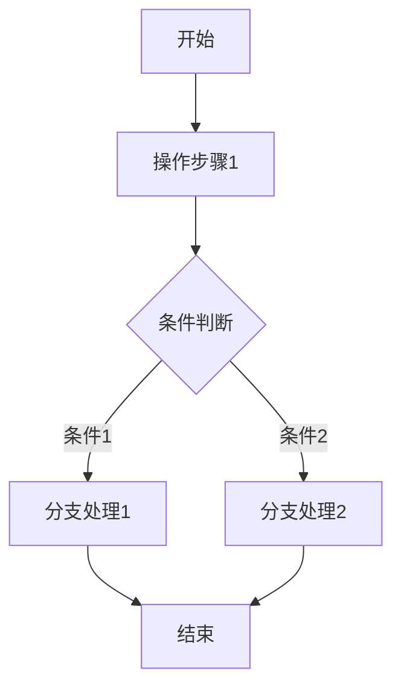
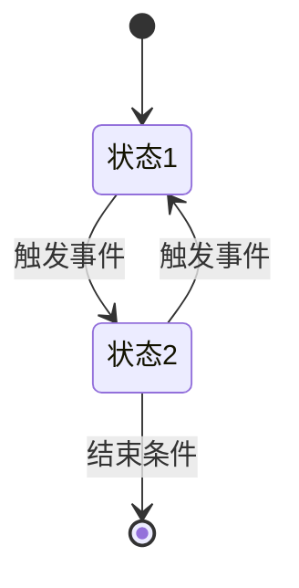

# 页面章节模板

```
#### 4.1.1.{n}. {页面名称}

##### 1. 功能概述

- **功能描述**：{描述该页面的核心功能}
- **业务描述**：{描述该页面的业务价值和使用场景}
- **使用角色**：{列出使用该功能的角色}
- **触发条件**：{描述进入该页面的触发条件}

##### 2. 界面设计

###### 2.1 页面原型

（待补充）

###### 2.2 输出项说明

| 字段名称 | 字段标识 | 数据类型 | 数据来源 | 格式说明 |
|----------|----------|----------|----------|----------|
| {字段中文名} | {snake_case} | {string/number/boolean} | {系统生成/用户输入/外部接口} | {格式描述} |

##### 3. 业务逻辑

###### 3.1 流程图

**{操作名称}流程**



###### 3.2 业务规则

| 规则编号 | 规则名称 | 适用场景 | 规则描述 | 错误提示 |
|----------|----------|----------|----------|----------|
| RULE-{模块缩写}-{序号} | {规则名称} | {适用场景} | {具体规则描述} | {违反规则时的提示文案} |

###### 3.3 状态机设计

**{实体名称}状态定义**

| 状态编码 | 状态名称 | 状态描述 |
|----------|----------|----------|
| {state_code} | {状态名称} | {状态描述} |

**状态流转规则**



##### 4. 交互设计

###### 4.1 输入项说明

| 字段名称 | 字段标识 | 字段类型 | 必填 | 数据类型 | 长度限制 | 校验规则 | 取值范围 | 来源 | 提示文案 | 备注 |
|----------|----------|----------|------|----------|----------|----------|----------|------|----------|------|
| {字段中文名} | {snake_case} | {输入类型} | {是/否} | {string/number} | {最大长度} | {校验规则} | {可选值} | {来源} | {提示} | {备注} |

###### 4.2 交互说明

1. **{操作名称}**
   - 步骤1：{描述}
   - 步骤2：{描述}
   - 步骤3：{描述}

###### 4.3 错误提示文案

**表单校验提示**

| 校验字段 | 校验场景 | 提示文案 |
|----------|----------|----------|
| {字段名称} | {校验场景} | {提示文案} |

**业务异常提示**

| 异常场景 | 错误码 | 提示文案 |
|----------|--------|----------|
| {异常场景描述} | {ERROR-XXX-001} | {提示文案} |

##### 5. 数据设计

###### 5.1 数据流转说明

| 字段/数据 | 来源 | 获取方式 | 说明 |
|-----------|------|----------|------|
| {数据名称} | {来源模块/系统} | {API/数据库/缓存} | {补充说明} |

###### 5.2 数据权限设计

**角色数据范围**

| 角色 | 数据范围 | 说明 |
|------|----------|------|
| {角色名称} | {数据范围} | {补充说明} |

**功能权限点**

| 权限标识 | 权限名称 |
|----------|----------|
| {module:action} | {权限名称} |

##### 6. 扩展功能

###### 6.1 批量操作规则

| 操作名称 | 单次上限 | 前置条件 | 成功提示 |
|----------|----------|----------|----------|
| {操作名称} | {数量上限} | {前置条件} | {成功提示文案} |

###### 6.2 操作日志要求

| 操作类型 | 记录内容 | 保留时长 |
|----------|----------|----------|
| {操作类型} | {记录的字段} | {保留时间} |

---
```

## 使用说明

1. 根据源码实际情况，按需删减子模块
2. 功能概述为必须项，不可删除
3. 页面原型标题保留，内容可后续补充
4. 无状态流转时，删除状态机设计章节
5. 无批量操作时，删除扩展功能章节