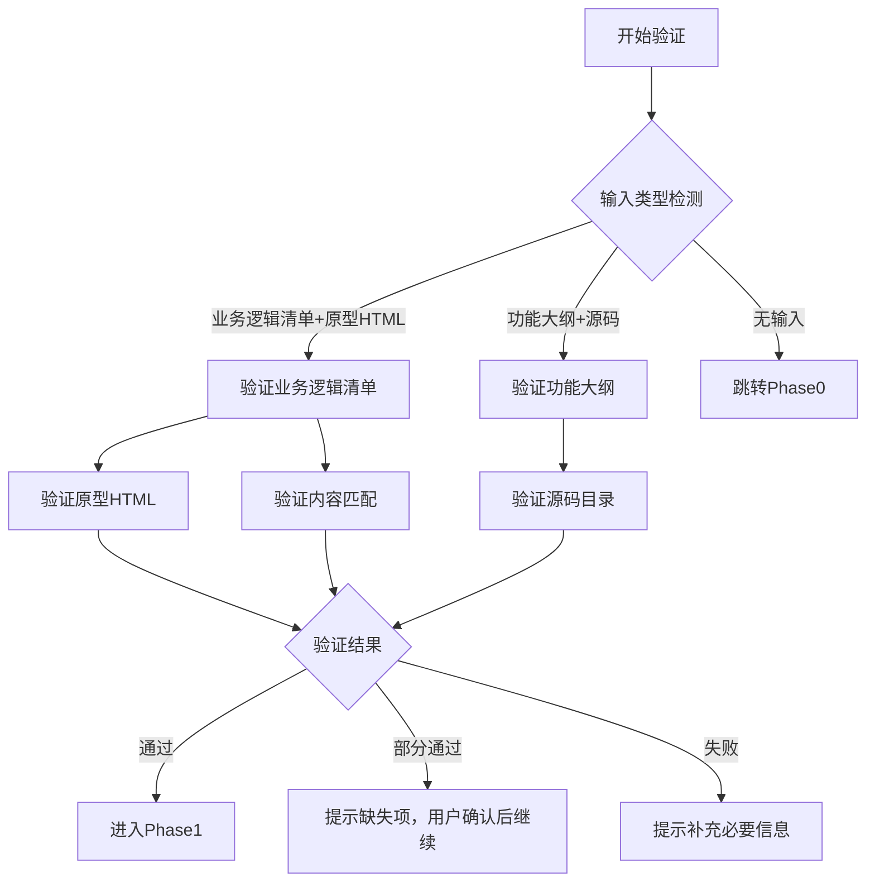

# 输入验证规则 V3.0

定义如何验证输入材料（业务逻辑清单、原型HTML、功能大纲）是否符合 PRD 生成要求。

---

## 输入类型检测

| 输入类型 | 检测条件 | 验证规则 |
|----------|----------|----------|
| **业务逻辑清单+原型HTML** | 业务逻辑清单文件存在 + 原型HTML目录存在 | 双材料验证 |
| **功能大纲+源码** | 功能大纲文件存在 + 源码目录存在 | 原有验证（保留） |
| **无输入** | 都不存在 | Phase0生成草案 |

---

## 业务逻辑清单验证

### 结构验证

| 验证项 | 验证规则 | 必要性 | 失败处理 |
|--------|----------|--------|----------|
| 文件格式 | 文件名匹配 `业务逻辑清单_V{版本}.md` | 必须 | 提示文件名格式错误 |
| 版本号 | 文件名包含版本号（如V0.3） | 必须 | 提示补充版本号 |
| 页面章节 | 至少包含一个H3页面章节 | 必须 | 提示补充页面定义 |

### 章节验证

| 验证项 | 验证规则 | 必要性 | 失败处理 |
|--------|----------|--------|----------|
| 功能用例表 | 每个页面章节包含功能用例表 | 必须 | 提示补充功能用例表 |
| 用例表非空 | 功能用例表至少包含1条用例 | 必须 | 提示补充用例 |
| 用例表结构 | 包含场景/操作/预期结果列 | 必须 | 提示修正表结构 |
| 关键字段表 | 每个页面章节包含关键字段数据来源表 | 必须 | 提示补充字段表 |
| 字段表非空 | 字段表至少包含1条字段 | 必须 | 提示补充字段 |

### 可选章节验证

| 验证项 | 验证规则 | 必要性 | 失败处理 |
|--------|----------|--------|----------|
| HMW问题陈述 | 包含HMW或问题陈述章节 | 推荐 | 不影响生成，可补充 |
| 成功标准 | 包含成功标准定义 | 推荐 | 不影响生成 |
| 业务逻辑增强 | 包含业务逻辑增强表 | 推荐 | 不影响生成，规则为空 |
| 状态流转表 | 包含状态流转定义（有状态时必须） | 按需 | 无状态时不要求 |
| 跳转关系表 | 包含页面导航跳转关系 | 推荐 | 不影响系统流程图生成 |
| 登录拦截表 | 包含登录拦截定义 | 推荐 | 不影响权限设计 |

---

## 原型HTML验证

### 目录验证

| 验证项 | 验证规则 | 必要性 | 失败处理 |
|--------|----------|--------|----------|
| 目录存在 | 原型HTML目录路径有效 | 必须 | 提示目录不存在 |
| HTML文件存在 | 目录包含至少1个HTML文件 | 必须 | 提示无原型文件 |
| 页面数量匹配 | HTML文件数 ≥ 业务逻辑清单页面数 | 推荐 | 提示页面数量不匹配 |

### 文件验证

| 验证项 | 验证规则 | 必要性 | 失败处理 |
|--------|----------|--------|----------|
| HTML5语法 | 文件包含DOCTYPE声明 | 推荐 | 不影响提取 |
| 可运行 | 浏览器可直接打开运行 | 推荐 | 不影响提取 |
| 内联完整 | CSS/JS内联在HTML内 | 推荐 | 不影响提取 |

---

## 功能大纲+源码验证（原有）

### 功能大纲验证

| 验证项 | 验证规则 | 必要性 |
|--------|----------|--------|
| 文件存在 | 功能大纲文件路径有效 | 必须 |
| 模块定义 | 包含模块层级定义 | 必须 |
| 功能点列表 | 每个模块包含功能点列表 | 必须 |

### 源码验证

| 验证项 | 验证规则 | 必要性 |
|--------|----------|--------|
| 目录存在 | 源码目录路径有效 | 必须 |
| 代码文件 | 目录包含代码文件 | 必须 |
| 项目类型 | HTML/JS/TypeScript项目 | 必须 |

---

## 验证流程



---

## 内容匹配验证

### 页面匹配验证

| 验证项 | 验证规则 | 失败处理 |
|--------|----------|----------|
| 页面名称匹配 | 业务逻辑清单页面名与原型HTML文件名对应 | 提示页面不匹配 |
| 页面数量匹配 | 原型HTML数量 ≥ 业务逻辑清单页面数 | 提示原型不完整 |

### 字段匹配验证

| 验证项 | 验证规则 | 失败处理 |
|--------|----------|----------|
| 输入项匹配 | 业务逻辑清单用户输入字段 → 原型HTML输入组件 | 提示字段未实现 |
| 输出项匹配 | 业务逻辑清单系统生成字段 → 原型HTML展示组件 | 提示字段未展示 |

---

## 验证输出格式

```json
{
  "input_type": "logic_list+prototype_html|feature_outline+sourcecode|none",
  "logic_list": {
    "valid": true|false,
    "checks": [
      {"item": "页面章节", "result": "pass", "count": 5},
      {"item": "功能用例表", "result": "pass", "total_cases": 25},
      {"item": "关键字段表", "result": "pass", "total_fields": 30},
      {"item": "状态流转表", "result": "pass"},
      {"item": "跳转关系表", "result": "fail", "message": "缺少跳转关系定义"}
    ],
    "missing": ["跳转关系表"],
    "can_proceed": true
  },
  "prototype_html": {
    "valid": true|false,
    "checks": [
      {"item": "目录存在", "result": "pass"},
      {"item": "HTML文件数量", "result": "pass", "count": 5},
      {"item": "页面数量匹配", "result": "pass"}
    ],
    "can_proceed": true
  },
  "overall": {
    "valid": true|false,
    "can_proceed": true|false,
    "suggestion": "请补充跳转关系表以生成系统流程图"
  }
}
```

---

## 验证时机

| 时机 | 验证内容 |
|------|----------|
| Phase0之前 | 输入类型检测 |
| Phase1之前 | 输入材料结构验证 |
| Phase1之后 | 内容匹配验证 |

---

## 验证工具函数

```javascript
// 业务逻辑清单验证
function validateLogicList(filePath) {
  const content = readFile(filePath);
  const checks = [];
  
  // 检测页面章节
  const h3Count = (content.match(/^###\s/gm) || []).length;
  checks.push({
    item: "页面章节",
    result: h3Count > 0 ? "pass" : "fail",
    count: h3Count
  });
  
  // 检测功能用例表
  const useCaseTableCount = (content.match(/功能用例表/g) || []).length;
  checks.push({
    item: "功能用例表",
    result: useCaseTableCount >= h3Count ? "pass" : "fail",
    message: useCaseTableCount < h3Count ? "部分页面缺少功能用例表" : null
  });
  
  // 检测关键字段表
  const fieldTableCount = (content.match(/关键字段数据来源/g) || []).length;
  checks.push({
    item: "关键字段表",
    result: fieldTableCount >= h3Count ? "pass" : "fail"
  });
  
  return {
    valid: checks.every(c => c.result === "pass"),
    checks,
    can_proceed: checks.filter(c => c.result === "fail").length < 2
  };
}

// 原型HTML验证
function validatePrototypeHtml(dirPath) {
  const htmlFiles = listFiles(dirPath, "*.html");
  const checks = [];
  
  checks.push({
    item: "目录存在",
    result: htmlFiles.length > 0 ? "pass" : "fail"
  });
  
  checks.push({
    item: "HTML文件数量",
    result: "pass",
    count: htmlFiles.length
  });
  
  return {
    valid: htmlFiles.length > 0,
    checks,
    can_proceed: htmlFiles.length > 0
  };
}
```

---

## 验证清单汇总

### 业务逻辑清单验证清单

- [ ] 文件名格式正确（含版本号）
- [ ] 至少包含一个页面章节
- [ ] 每个页面包含功能用例表
- [ ] 每个功能用例表非空
- [ ] 每个页面包含关键字段数据来源表
- [ ] 每个字段表非空

### 原型HTML验证清单

- [ ] 原型HTML目录存在
- [ ] 目录包含HTML文件
- [ ] HTML文件数量 ≥ 业务逻辑清单页面数

### 内容匹配验证清单

- [ ] 页面名称与HTML文件名对应
- [ ] 用户输入字段有对应输入组件
- [ ] 系统生成字段有对应展示组件

### 可继续生成条件

- 页面章节 + 功能用例表 + 关键字段表 都存在 → 可继续
- 缺少跳转关系表 → 可继续（系统流程图为空）
- 缺少状态流转表 → 可继续（状态机设计为空）
- 缺少原型HTML → 可继续（界面设计章节为空）